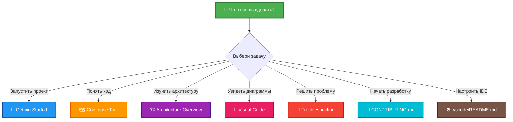

# 📚 Документация проекта

Полное руководство по LLM-ассистенту Telegram бота.

---

## 🚀 Начало работы (High Priority)

Документы для быстрого старта и понимания проекта:

### 1. [Getting Started](guides/getting-started.md) 🌟
**Первый шаг для новичков**
- Установка и настройка за 10 минут
- Получение токенов (Telegram, OpenRouter)
- Первый запуск и диалог с ботом
- Решение проблем при установке

**Для кого:** Абсолютные новички

---

### 2. [Codebase Tour](guides/codebase-tour.md) 🗺️
**Экскурсия по коду**
- Структура проекта (что где лежит)
- Описание каждого модуля с примерами
- Путь чтения кода (в каком порядке)
- Где искать что (команды, конфигурация, тесты)

**Для кого:** Разработчики, изучающие проект

---

### 3. [Architecture Overview](guides/architecture-overview.md) 🏗️
**Архитектура системы**
- High-level и low-level диаграммы
- Sequence diagrams (flow обработки)
- Принципы дизайна (KISS, SOLID, DRY)
- Взаимодействие компонентов

**Для кого:** Архитекторы, senior разработчики

---

### 4. [Troubleshooting](guides/troubleshooting.md) 🐛
**Решение проблем**
- Частые ошибки и их решения
- Диагностика проблем (flowcharts)
- Проблемы установки, запуска, API
- Debugging tips

**Для кого:** Все, у кого что-то не работает

---

### 5. [Visual Guide](guides/visual-guide.md) 🎨
**Визуальный гайд проекта**
- 35 Mermaid диаграмм с разных точек зрения
- System, Component, Data Flow views
- Sequence diagrams, State machines
- User journey, Error handling
- Development workflow, Testing strategy
- Контрастные цвета для читаемости

**Для кого:** Визуалы, архитекторы, все кто любит диаграммы

---

## 📖 Основная документация

### [Vision](vision.md) 🎯
**Техническое видение проекта**
- Технологический стек и обоснование
- Качество кода (Ruff, Mypy, Pytest)
- Тестирование (TDD, coverage 96%)
- CI/CD pipeline

**Статус:** ✅ Актуально

---

### [Task List](tasklist.md) 📋
**План разработки**
- 8 итераций (все завершены)
- История развития проекта
- Roadmap будущих фич

**Статус:** ✅ Актуально

---

### [Idea](idea.md) 💡
**Идея и концепция проекта**
- Зачем создавался проект
- Основные цели MVP
- Специализация через промпты

**Статус:** ✅ Актуально

---

## 🛠️ Для разработчиков

### [CONTRIBUTING.md](../CONTRIBUTING.md) 🤝
**Гайд для контрибьюторов**
- Workflow разработки (fork, branch, PR)
- Code style (SOLID, DRY, type hints)
- Требования к PR (CI/CD checks)
- Code review процесс

---

### Правила кодирования

**Расположение:** `.cursor/rules/`

#### [conventions.mdc](../.cursor/rules/conventions.mdc)
- KISS, SOLID, DRY принципы
- 1 класс = 1 файл
- Type hints (100% coverage)
- Ruff, Mypy конфигурация

#### [qa_conventions.mdc](../.cursor/rules/qa_conventions.mdc)
- TDD практики
- Pytest, AsyncMock
- Coverage метрики (>95%)
- Фикстуры и моки

#### [workflow_tdd.mdc](../.cursor/rules/workflow_tdd.mdc)
- Red-Green-Refactor цикл
- TDD workflow пошагово
- Лучшие практики TDD

---

## 🎨 IDE конфигурация

### [.vscode/README.md](../.vscode/README.md)
**Настройка VSCode/Cursor**
- Автоформатирование при сохранении
- Интеграция линтера и type checker
- Запуск и отладка через F5
- Test Explorer
- Рекомендованные расширения

---

## 📊 Навигация по типу задачи



---

## 🎓 Рекомендуемый путь изучения

### Для новичков (полный онбординг)

```
1. 📖 Getting Started        (15 мин) → Запустить проект
2. 🗺️ Codebase Tour         (30 мин) → Понять структуру
3. 🏗️ Architecture Overview  (20 мин) → Понять дизайн
4. 🤝 CONTRIBUTING.md        (15 мин) → Начать разработку
```

**Итого:** ~1.5 часа до первого PR

---

### Для опытных разработчиков

```
1. 🗺️ Codebase Tour         (15 мин) → Быстрый обзор
2. 🏗️ Architecture Overview  (10 мин) → Понять архитектуру
3. 🤝 CONTRIBUTING.md        (5 мин)  → Workflow
```

**Итого:** ~30 минут до первого PR

---

### Для решения проблем

```
1. 🐛 Troubleshooting        → Найти решение
2. 📖 Getting Started        → Если проблема при установке
3. GitHub Issues            → Если решение не найдено
```

---

## 📈 Метрики проекта

| Метрика | Значение |
|---------|----------|
| **Модулей (src/)** | 9 |
| **Тестов** | 61 |
| **Coverage** | 96% |
| **Строк кода** | ~900 |
| **Документов** | 12 (5 новых) |
| **Mermaid диаграмм** | 47 (35 в Visual Guide) |
| **CI/CD** | ✅ GitHub Actions |

---

## 🔍 Быстрый поиск

| Хочу узнать | Где смотреть |
|-------------|--------------|
| Как установить | [Getting Started](guides/getting-started.md) |
| Где находится X | [Codebase Tour](guides/codebase-tour.md) |
| Как работает Y | [Architecture Overview](guides/architecture-overview.md) |
| Визуализация проекта | [Visual Guide](guides/visual-guide.md) 🎨 |
| Почему не работает | [Troubleshooting](guides/troubleshooting.md) |
| Как внести изменения | [CONTRIBUTING.md](../CONTRIBUTING.md) |
| Как писать тесты | [qa_conventions.mdc](../.cursor/rules/qa_conventions.mdc) |
| Правила кодирования | [conventions.mdc](../.cursor/rules/conventions.mdc) |
| TDD процесс | [workflow_tdd.mdc](../.cursor/rules/workflow_tdd.mdc) |
| Настройка IDE | [.vscode/README.md](../.vscode/README.md) |
| Техническое видение | [vision.md](vision.md) |

---

## 🆘 Нужна помощь?

### Порядок действий

1. **Проверь документацию** - возможно ответ уже есть
2. **[Troubleshooting](guides/troubleshooting.md)** - решение частых проблем
3. **Логи** - запусти с `LOG_LEVEL=DEBUG` и читай ошибки
4. **GitHub Issues** - поищи похожую проблему
5. **Создай issue** - если не нашел решение

### Шаблон для вопросов

```markdown
**Что пытаюсь сделать:** ...
**Что пошло не так:** ...
**Что уже пробовал:** ...
**Логи:** ...
```

---

## 🤝 Вклад в документацию

Нашел опечатку? Хочешь дополнить документацию?

1. Fork репозитория
2. Отредактируй документ
3. Создай Pull Request

**Критерии качества документации:**
- ✅ Простота и понятность
- ✅ Примеры кода где возможно
- ✅ Актуальность (соответствие коду)
- ✅ Mermaid диаграммы для визуализации
- ✅ Эмодзи для навигации

---

## 📝 Статус документации

| Документ | Статус | Последнее обновление |
|----------|--------|----------------------|
| Getting Started | ✅ Готово | 2025-10-16 |
| Codebase Tour | ✅ Готово | 2025-10-16 |
| Architecture Overview | ✅ Готово | 2025-10-16 |
| Troubleshooting | ✅ Готово | 2025-10-16 |
| Visual Guide | ✅ Готово | 2025-10-16 |
| Vision | ✅ Актуально | 2025-10-11 |
| Task List | ✅ Актуально | 2025-10-11 |
| CONTRIBUTING | ✅ Актуально | 2025-10-11 |

---

## 🎯 Roadmap документации (возможные дополнения)

**Средний приоритет:**
- `data-model.md` - детальное описание моделей данных
- `integrations.md` - работа с Telegram и OpenRouter API
- `development-workflow.md` - процесс разработки
- `testing-guide.md` - детальный гайд по тестированию

**Низкий приоритет:**
- `deployment.md` - деплой в production
- `extending-bot.md` - как добавлять новые фичи
- `code-quality.md` - инструменты качества кода
- `ci-cd.md` - детали CI/CD pipeline

**Опционально:**
- `adr/` - Architecture Decision Records
- `glossary.md` - глоссарий терминов
- `diagrams/` - визуальные схемы

**Создание по запросу** - если нужен конкретный документ, создай issue.

---

**Приятного изучения проекта! 🚀**

**Вопросы?** → [Troubleshooting](guides/troubleshooting.md) или GitHub Issues
