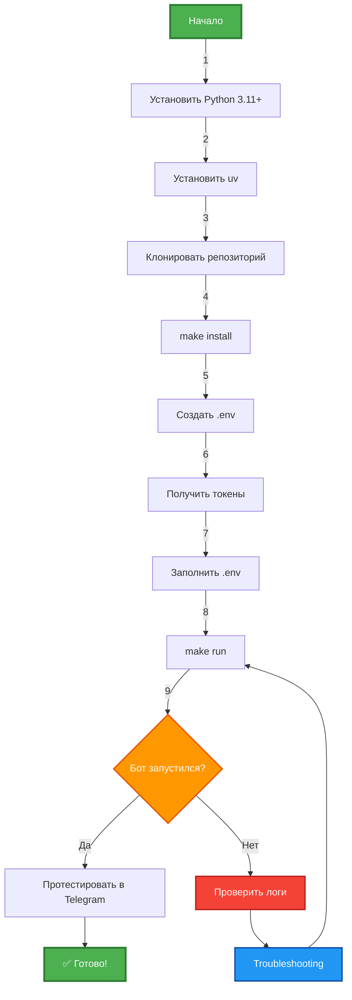

# 🚀 Getting Started - Быстрый старт

Пошаговое руководство для запуска LLM-ассистента Telegram бота с нуля.

## ⏱️ Время на setup: ~10 минут

---

## 📋 Предварительные требования

### Обязательно

| Требование | Версия | Проверка |
|-----------|--------|----------|
| **Python** | 3.11+ | `python --version` |
| **uv** | latest | `uv --version` |
| **Git** | любая | `git --version` |

### Получить до начала

- ✅ **Telegram Bot Token** - получить у [@BotFather](https://t.me/BotFather)
- ✅ **OpenRouter API Key** - зарегистрироваться на [openrouter.ai](https://openrouter.ai)

---

## 🔧 Установка uv (если еще нет)

### Windows (PowerShell)
```powershell
powershell -c "irm https://astral.sh/uv/install.ps1 | iex"
```

### macOS/Linux
```bash
curl -LsSf https://astral.sh/uv/install.sh | sh
```

**Проверка:**
```bash
uv --version
# Ожидается: uv 0.x.x
```

---

## 📦 Шаг 1: Клонирование репозитория

```bash
# Клонировать проект
git clone <repository-url>
cd systech-aidd-test

# Проверить структуру
ls
# Ожидается: src/, tests/, docs/, Makefile, README.md
```

---

## 🔨 Шаг 2: Установка зависимостей

```bash
# Установка через Makefile (рекомендуется)
make install

# Или напрямую через uv
uv sync
```

**Что происходит:**
- Создается виртуальное окружение `.venv/`
- Устанавливаются зависимости из `pyproject.toml`
- Устанавливаются dev-зависимости (pytest, ruff, mypy)

**Проверка:**
```bash
# Проверить наличие .venv
ls .venv

# Проверить установленные пакеги
uv pip list
# Ожидается: aiogram, openai, python-dotenv, pytest...
```

---

## ⚙️ Шаг 3: Настройка конфигурации

### 3.1 Создать .env файл

```bash
# Копировать шаблон
cp .env.example .env

# Или на Windows
copy .env.example .env
```

### 3.2 Заполнить обязательные токены

Открыть `.env` в редакторе и заполнить:

```bash
# === ОБЯЗАТЕЛЬНЫЕ ПАРАМЕТРЫ ===
TELEGRAM_BOT_TOKEN=your_telegram_bot_token_here
OPENROUTER_API_KEY=your_openrouter_api_key_here

# === ОПЦИОНАЛЬНЫЕ (имеют значения по умолчанию) ===
DEFAULT_MODEL=openai/gpt-3.5-turbo
MAX_TOKENS=1000
TEMPERATURE=0.7
MAX_HISTORY_MESSAGES=10
SYSTEM_PROMPT=You are a helpful AI assistant.
LOG_LEVEL=INFO
```

### 3.3 Как получить токены

#### 🤖 Telegram Bot Token

1. Открыть Telegram, найти [@BotFather](https://t.me/BotFather)
2. Отправить `/newbot`
3. Следовать инструкциям (имя бота, username)
4. Скопировать токен (формат: `1234567890:ABCdefGHIjklMNOpqrsTUVwxyz`)
5. Вставить в `.env` как `TELEGRAM_BOT_TOKEN`

#### 🔑 OpenRouter API Key

1. Перейти на [openrouter.ai](https://openrouter.ai)
2. Зарегистрироваться/войти
3. Перейти в Settings → API Keys
4. Создать новый ключ
5. Скопировать ключ (формат: `sk-or-v1-...`)
6. Вставить в `.env` как `OPENROUTER_API_KEY`

---

## 🎯 Шаг 4: Запуск бота

```bash
# Запуск через Makefile (рекомендуется)
make run

# Или через uv
uv run python src/main.py

# Или с активацией venv
source .venv/bin/activate  # Linux/macOS
.venv\Scripts\activate     # Windows
python src/main.py
```

**Ожидаемый вывод:**

```
2024-01-15 10:30:15 - __main__ - INFO - === Запуск LLM-ассистента ===
2024-01-15 10:30:15 - __main__ - INFO - ✅ Конфигурация загружена
2024-01-15 10:30:15 - __main__ - INFO - ✅ LLM клиент инициализирован
2024-01-15 10:30:15 - __main__ - INFO - ✅ ConversationManager инициализирован
2024-01-15 10:30:15 - __main__ - INFO - ✅ Telegram бот инициализирован
2024-01-15 10:30:15 - __main__ - INFO - 🚀 Бот запущен! Нажмите Ctrl+C для остановки
```

✅ **Бот работает!** Переходим к тестированию.

---

## 🧪 Шаг 5: Первый диалог

### 5.1 Найти бота в Telegram

1. Открыть Telegram
2. Найти бота по username (который указали в @BotFather)
3. Нажать `/start`

**Ожидаемый ответ:**
```
👋 Привет! Я LLM-ассистент...

Я могу:
✅ Вести диалог с сохранением контекста
✅ Запоминать до 10 последних сообщений
✅ Отвечать на любые вопросы

Команды:
/help - справка
/role - моя роль и возможности
/clear - очистить историю диалога

Просто напиши мне что-нибудь!
```

### 5.2 Проверить команды

```
/help    → показывает справку
/role    → показывает текущую роль бота
/clear   → очищает историю диалога
```

### 5.3 Написать сообщение

```
User: Привет! Как дела?
Bot: [Ответ от LLM через OpenRouter]
```

✅ **Диалог работает!** Setup завершен.

---

## 🎨 Опционально: Специализация бота

По умолчанию бот - универсальный ассистент. Можно специализировать его через системные промпты.

### Доступные роли

| Роль | Файл | Описание |
|------|------|----------|
| 🤖 AI Assistant | `prompts/system_prompt.txt` | Универсальный помощник |
| 🐍 Python Code Reviewer | `prompts/system_prompt_python_code_reviewer.txt` | Эксперт по ревью кода |
| 📝 Technical Writer | `prompts/system_prompt_technical_writer.txt` | Технический писатель |

### Как переключить роль

1. Открыть `.env`
2. Добавить/изменить строку:
   ```bash
   SYSTEM_PROMPT_FILE=prompts/system_prompt_python_code_reviewer.txt
   ```
3. Перезапустить бота (`Ctrl+C`, затем `make run`)
4. Проверить: `/role` в Telegram

---

## ✅ Проверка успешного setup

### Чеклист

- [ ] Python 3.11+ установлен
- [ ] uv установлен и работает
- [ ] Репозиторий склонирован
- [ ] Зависимости установлены (`make install`)
- [ ] `.env` файл создан и заполнен
- [ ] Бот запускается без ошибок
- [ ] Бот отвечает на `/start` в Telegram
- [ ] Диалог с ботом работает

### Тесты работоспособности

```bash
# 1. Проверить конфигурацию
uv run python -c "from src.config import Config; c = Config(); print('✅ Config OK')"

# 2. Проверить импорты
uv run python -c "from src.main import main; print('✅ Imports OK')"

# 3. Запустить тесты (опционально)
make test
# Ожидается: 61/61 tests passed, 96% coverage
```

---

## 🐛 Что-то пошло не так?

### Частые проблемы

#### ❌ `ValueError: TELEGRAM_BOT_TOKEN не установлен`
**Решение:** Проверь `.env` файл, убедись что токен скопирован полностью

#### ❌ `Error: Token is invalid`
**Решение:** Получи новый токен у @BotFather, старый мог истечь

#### ❌ `uv: command not found`
**Решение:** Установи uv по инструкции выше, перезапусти терминал

#### ❌ Бот не отвечает в Telegram
**Решение:**
- Проверь что бот запущен (в терминале должна быть строка "🚀 Бот запущен")
- Проверь токен в `.env`
- Посмотри логи в терминале на наличие ошибок

#### ❌ `API Error: Rate limit exceeded`
**Решение:** Подожди минуту, OpenRouter имеет лимиты на бесплатном плане

**Больше проблем?** → См. [docs/troubleshooting.md](troubleshooting.md)

---

## 🎓 Следующие шаги

После успешного запуска:

1. **📖 Изучить архитектуру** → [docs/architecture-overview.md](architecture-overview.md)
2. **🗺️ Тур по коду** → [docs/codebase-tour.md](codebase-tour.md)
3. **🛠️ Начать разработку** → [CONTRIBUTING.md](../CONTRIBUTING.md)
4. **🧪 Запустить тесты** → `make test`
5. **🎨 Настроить IDE** → [.vscode/README.md](../.vscode/README.md)

---

## 📊 Процесс установки (визуально)



---

**Готово!** Бот запущен и готов к работе. 🎉

**Вопросы?** Смотри [troubleshooting.md](troubleshooting.md) или создай issue на GitHub.
