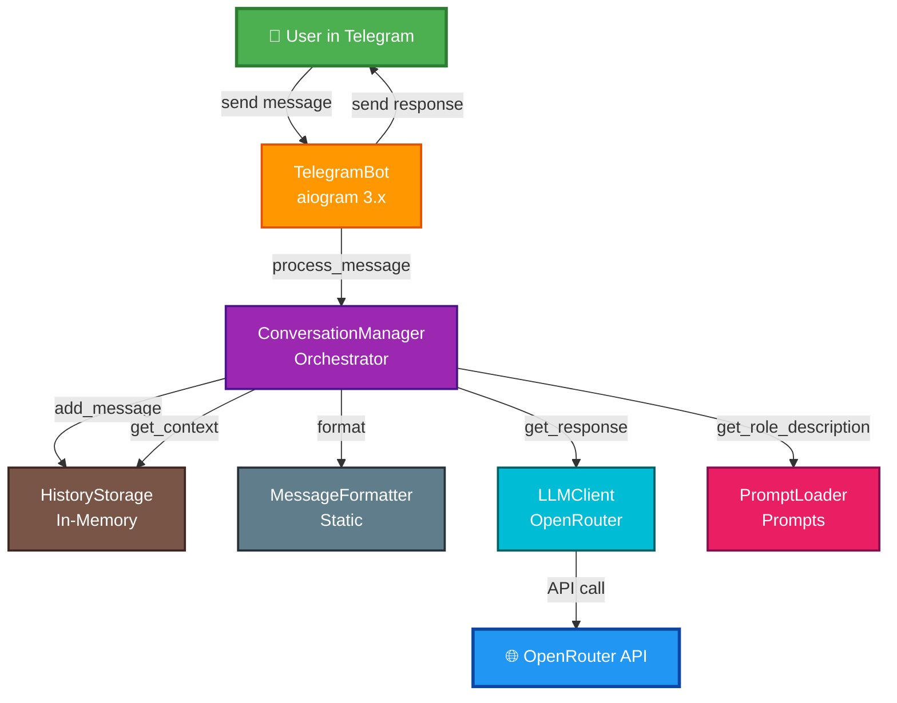
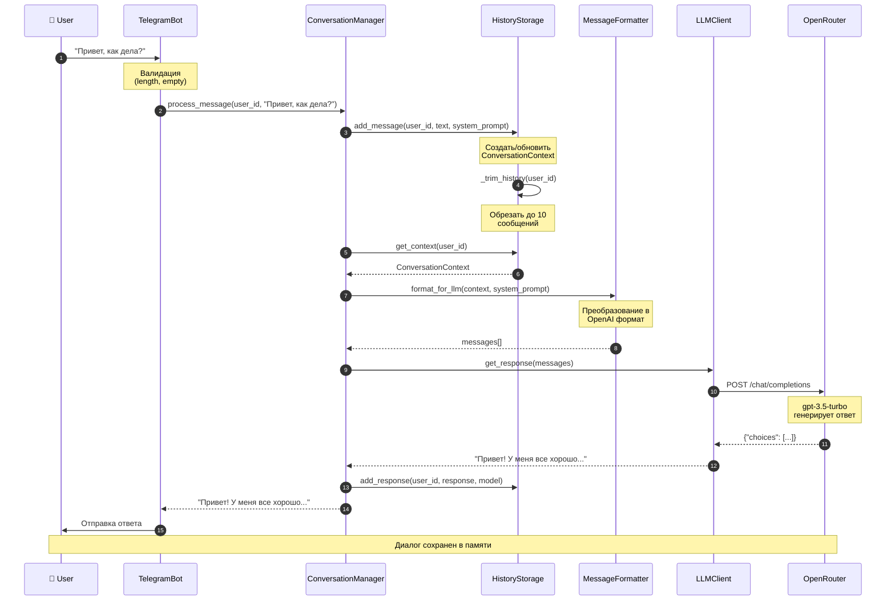
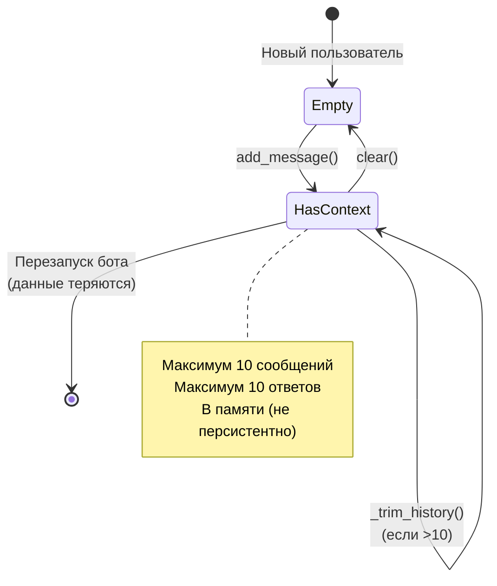
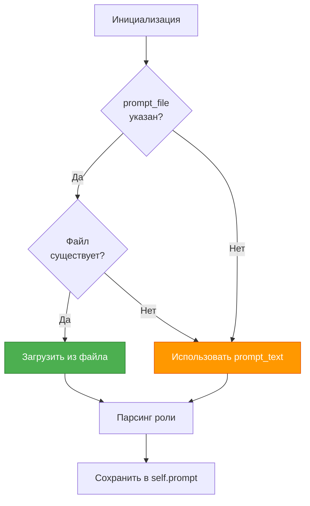
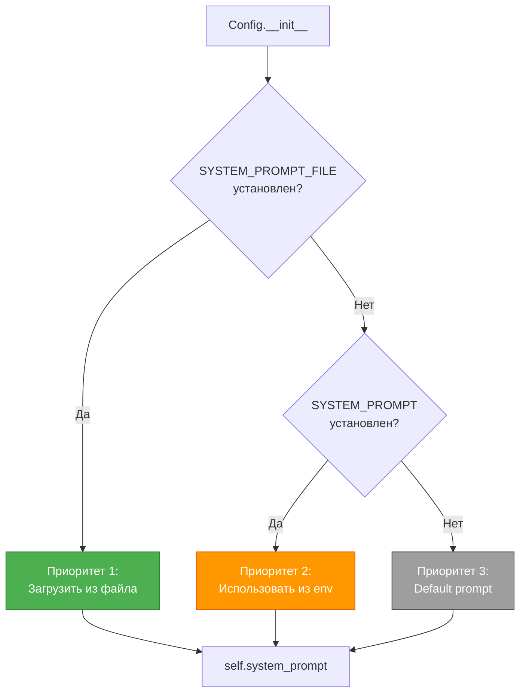
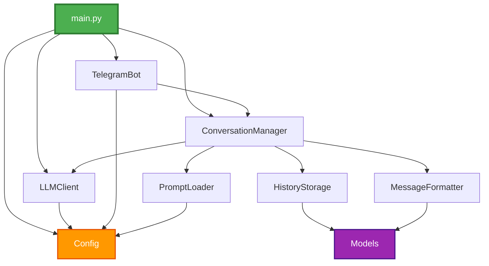
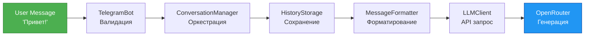
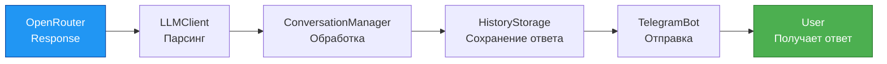
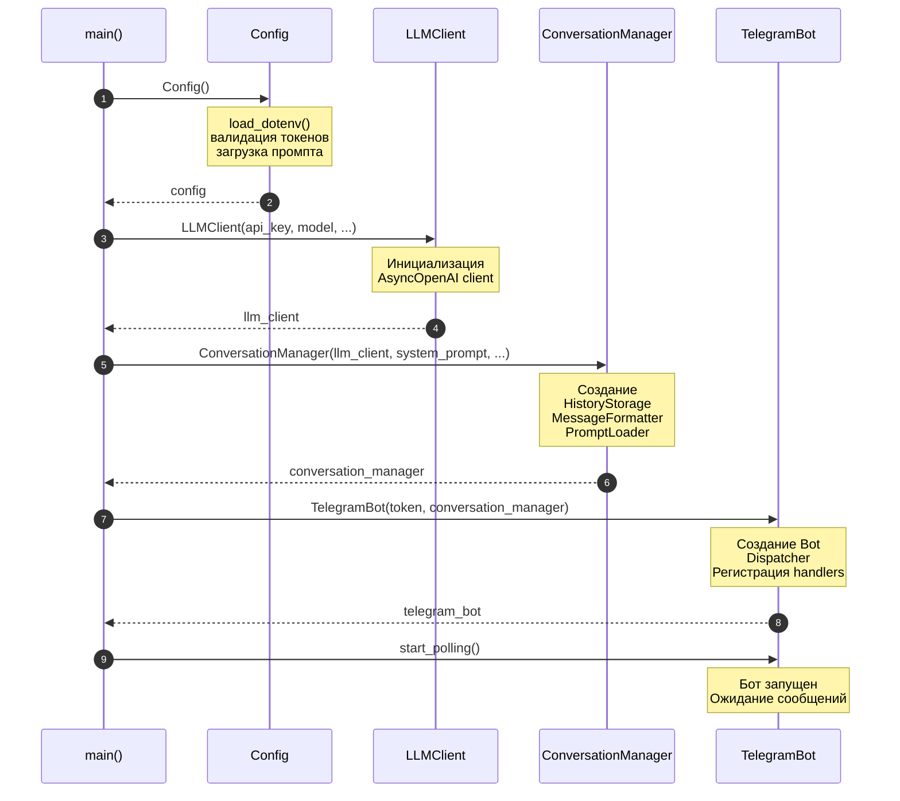

# 🏗️ Architecture Overview - Обзор архитектуры

Детальное описание архитектуры LLM-ассистента Telegram бота.

---

## 🎯 Архитектурные принципы

### KISS (Keep It Simple, Stupid)
- Минимум абстракций
- Прямолинейный код
- Нет оверинжиниринга

### SOLID
- **SRP:** Один класс = одна ответственность
- **DRY:** Нет дублирования кода
- **1 класс = 1 файл:** Строгое соблюдение

### Async/Await
- Все I/O операции асинхронные
- Использование aiogram 3.x и openai async client

---

## 📊 High-Level Architecture



---

## 🔄 Component Interaction

### Основные компоненты

| Компонент | Файл | Ответственность | Coverage |
|-----------|------|-----------------|----------|
| **TelegramBot** | `telegram_bot.py` | Telegram API, команды | 95% |
| **ConversationManager** | `conversation_manager.py` | Оркестрация диалога | 100% |
| **LLMClient** | `llm_client.py` | OpenRouter API | 96% |
| **HistoryStorage** | `history_storage.py` | Хранение истории | 95% |
| **MessageFormatter** | `message_formatter.py` | Форматирование API | 100% |
| **PromptLoader** | `prompt_loader.py` | Загрузка промптов | 100% |
| **Config** | `config.py` | Конфигурация | 100% |

---

## 📨 Message Flow (Sequence Diagram)



---

## 🧩 Component Details

### 1. TelegramBot - Telegram Integration Layer

**Ответственность:**
- Прием сообщений от пользователей
- Обработка команд (`/start`, `/help`, `/role`, `/clear`)
- Валидация входных данных
- Отправка ответов

**Зависимости:**
- `aiogram.Bot` - Telegram Bot API клиент
- `aiogram.Dispatcher` - Роутинг команд
- `ConversationManager` - Обработка диалога

**Команды:**

```mermaid
graph LR
    Start[/start] -->|cmd_start| Welcome[Приветствие]
    Help[/help] -->|cmd_help| HelpText[Справка]
    Role[/role] -->|cmd_role| RoleInfo[Роль бота]
    Clear[/clear] -->|cmd_clear| ClearHistory[Очистить историю]
    Text[Текст] -->|handle_message| Process[Обработка диалога]

    style Start fill:#4CAF50,stroke:#2E7D32,color:#fff
    style Help fill:#2196F3,stroke:#0D47A1,color:#fff
    style Role fill:#9C27B0,stroke:#4A148C,color:#fff
    style Clear fill:#FF9800,stroke:#E65100,color:#fff
    style Text fill:#00BCD4,stroke:#006064,color:#fff
```

**Валидация:**
```python
# 1. Проверка пустого сообщения
if not text or not text.strip():
    return  # Игнорировать

# 2. Проверка длины
if len(text) > MAX_MESSAGE_LENGTH:
    await message.answer(ERROR_MESSAGE_TOO_LONG)
    return

# 3. Проверка from_user
if not message.from_user:
    raise ValueError("No user info")
```

---

### 2. ConversationManager - Orchestrator

**Ответственность:**
- Координация всех компонентов
- Управление flow обработки сообщения
- Интеграция storage, formatter, LLM client

**Зависимости:**
```python
self.llm_client = llm_client           # LLMClient
self.storage = HistoryStorage(...)     # Хранилище
self.formatter = MessageFormatter()     # Форматтер
self.prompt_loader = PromptLoader(...) # Загрузчик промптов
```

**Методы:**
```python
async process_message(user_id: int, text: str) -> str
    # 1. Сохранить сообщение
    # 2. Получить контекст
    # 3. Форматировать для API
    # 4. Запросить LLM
    # 5. Сохранить ответ
    # 6. Вернуть результат

clear_history(user_id: int) -> None
    # Очистить историю пользователя

get_role_description() -> str
    # Информация о роли для /role команды
```

---

### 3. HistoryStorage - In-Memory Storage

**Ответственность:**
- Хранение контекстов диалогов
- Управление размером истории (max 10)
- CRUD операции для сообщений/ответов

**Структура данных:**
```python
contexts: dict[int, ConversationContext]
# user_id → ConversationContext
```

**ConversationContext:**
```python
@dataclass
class ConversationContext:
    user_id: int
    messages: list[UserMessage]      # До 10
    responses: list[LLMResponse]     # До 10
    system_prompt: str
```

**Диаграмма состояний:**



**Обрезка истории:**
```python
def _trim_history(self, user_id: int) -> None:
    context = self.contexts.get(user_id)
    if not context:
        return

    # Оставить только последние max_history
    if len(context.messages) > self.max_history:
        context.messages = context.messages[-self.max_history:]

    if len(context.responses) > self.max_history:
        context.responses = context.responses[-self.max_history:]
```

---

### 4. MessageFormatter - API Formatter

**Ответственность:**
- Преобразование ConversationContext в OpenAI формат
- Формирование массива messages

**Метод:**
```python
@staticmethod
def format_for_llm(
    context: ConversationContext,
    system_prompt: str
) -> list[dict[str, Any]]
```

**Формат вывода:**
```json
[
    {
        "role": "system",
        "content": "You are a helpful AI assistant."
    },
    {
        "role": "user",
        "content": "Привет!"
    },
    {
        "role": "assistant",
        "content": "Здравствуй! Чем могу помочь?"
    },
    {
        "role": "user",
        "content": "Как дела?"
    }
]
```

**Логика чередования:**


---

### 5. LLMClient - OpenRouter API Client

**Ответственность:**
- Взаимодействие с OpenRouter API
- Отправка запросов к LLM
- Обработка ответов и ошибок

**Конфигурация:**
```python
client = AsyncOpenAI(
    base_url="https://openrouter.ai/api/v1",
    api_key=api_key
)
```

**API Request:**
```python
response = await self.client.chat.completions.create(
    model="openai/gpt-3.5-turbo",
    messages=[...],
    max_tokens=1000,
    temperature=0.7
)
```

**Обработка ошибок:**
```python
try:
    response = await self.client.chat.completions.create(...)
    content = response.choices[0].message.content

    # Обработка None
    if content is None:
        content = ""

    return content

except Exception as e:
    logger.error(f"Ошибка при запросе к LLM: {e}")
    raise  # Пробросить выше
```

---

### 6. PromptLoader - System Prompts

**Ответственность:**
- Загрузка системных промптов
- Парсинг структуры промпта
- Форматирование для `/role` команды

**Приоритет загрузки:**


**Структура промпта:**
```
Роль: Python Code Reviewer Expert

Ты опытный Python разработчик...

Твои принципы:
- SOLID, DRY, KISS
```

**Парсинг:**
- Извлекает "Роль: [название]" из первой строки
- Остальное - описание и инструкции

---

### 7. Config - Configuration Management

**Ответственность:**
- Загрузка переменных окружения
- Валидация обязательных параметров
- Значения по умолчанию

**Загрузка системного промпта:**



**Валидация:**
```python
# Обязательные
telegram_token = self._get_required_env("TELEGRAM_BOT_TOKEN")
openrouter_key = self._get_required_env("OPENROUTER_API_KEY")

# С дефолтами
default_model = self._get_optional_env(
    "DEFAULT_MODEL",
    "openai/gpt-3.5-turbo"
)
```

---

## 🔗 Dependency Graph



**Правило:** Нет циклических зависимостей

---

## 📦 Data Flow

### От пользователя к LLM



### От LLM к пользователю



---

## 🛡️ Error Handling Strategy

```mermaid
graph TD
    Start[Ошибка возникла] --> Where{Где?}

    Where -->|LLMClient| Log1[Логировать ошибку]
    Log1 --> Raise1[Пробросить выше]

    Where -->|ConversationManager| Raise2[Пробросить выше]

    Where -->|TelegramBot| Catch[Try/Catch]
    Catch --> Log2[Логировать детали]
    Log2 --> User[Показать пользователю<br/>понятное сообщение]

    Where -->|Config| Fatal[ValueError]
    Fatal --> Exit[exit(1)]

    Where -->|Main| MainCatch[Try/Catch в main]
    MainCatch --> MainLog[Логировать]
    MainLog --> Stop[Остановить бота]

    style Fatal fill:#F44336,stroke:#B71C1C,color:#fff
    style Exit fill:#F44336,stroke:#B71C1C,color:#fff
    style User fill:#4CAF50,stroke:#2E7D32,color:#fff
```

**Уровни обработки:**
1. **Config** - Fail Fast, exit(1) при отсутствии токенов
2. **LLMClient** - Логирование + проброс исключения
3. **ConversationManager** - Проброс исключения
4. **TelegramBot** - Перехват + понятное сообщение пользователю
5. **Main** - Финальный обработчик, graceful shutdown

---

## ⚙️ Configuration Hierarchy

```mermaid
graph TD
    Start[Запуск] --> LoadEnv[load_dotenv]
    LoadEnv --> Config[Config.__init__]

    Config --> Token1{TELEGRAM_BOT_TOKEN?}
    Token1 -->|Нет| Error1[ValueError]
    Token1 -->|Да| Token2{OPENROUTER_API_KEY?}
    Token2 -->|Нет| Error2[ValueError]
    Token2 -->|Да| Optional[Опциональные параметры]

    Optional --> Model[DEFAULT_MODEL<br/>default: gpt-3.5-turbo]
    Optional --> Tokens[MAX_TOKENS<br/>default: 1000]
    Optional --> Temp[TEMPERATURE<br/>default: 0.7]
    Optional --> History[MAX_HISTORY_MESSAGES<br/>default: 10]
    Optional --> Prompt[SYSTEM_PROMPT<br/>default: 'You are helpful...']
    Optional --> PromptFile[SYSTEM_PROMPT_FILE<br/>default: None]

    PromptFile -->|Если указан| LoadPrompt[Загрузить из файла]
    LoadPrompt --> Done[Config готов]
    Prompt --> Done
    Model --> Done
    Tokens --> Done
    Temp --> Done
    History --> Done

    Error1 --> Exit[exit(1)]
    Error2 --> Exit

    style Error1 fill:#F44336,stroke:#B71C1C,color:#fff
    style Error2 fill:#F44336,stroke:#B71C1C,color:#fff
    style Done fill:#4CAF50,stroke:#2E7D32,color:#fff
```

---

## 🚀 Initialization Flow



---

## 📊 Memory Management

### Что хранится в памяти

```mermaid
graph TD
    App[Приложение] --> CM[ConversationManager]
    CM --> HS[HistoryStorage]
    HS --> Contexts[contexts: dict]

    Contexts --> U1[user_id: 123]
    Contexts --> U2[user_id: 456]
    Contexts --> U3[user_id: 789]

    U1 --> C1[ConversationContext]
    C1 --> M1[messages: list[10]]
    C1 --> R1[responses: list[10]]

    U2 --> C2[ConversationContext]
    C2 --> M2[messages: list[10]]
    C2 --> R2[responses: list[10]]

    style App fill:#4CAF50,stroke:#2E7D32,color:#fff
    style Contexts fill:#FF9800,stroke:#E65100,color:#fff
    style C1 fill:#2196F3,stroke:#0D47A1,color:#fff
    style C2 fill:#2196F3,stroke:#0D47A1,color:#fff
```

**Ограничения:**
- Максимум 10 сообщений на пользователя
- Максимум 10 ответов на пользователя
- Данные теряются при перезапуске

**Оценка памяти (1000 пользователей):**
- 1 UserMessage ≈ 100 bytes
- 1 LLMResponse ≈ 500 bytes
- 1 ConversationContext ≈ 10 * (100 + 500) = 6KB
- 1000 пользователей ≈ 6MB

**Управление памятью:**
- Автоматическая обрезка истории (_trim_history)
- Команда `/clear` для ручной очистки
- Нет персистентности (простота MVP)

---

## 🔐 Security Considerations

### Текущие меры

1. **Токены в .env** - не коммитятся в git
2. **Безопасное логирование** - не логируются токены и полные тексты
3. **Валидация входных данных** - проверка длины, пустые сообщения
4. **Type safety** - 100% type hints, mypy strict mode

### Ограничения (известные)

- Нет rate limiting на уровне приложения (есть на API)
- Нет аутентификации пользователей (публичный бот)
- Данные в памяти (не зашифрованы)

---

## 🎯 Design Patterns

### Используемые паттерны

| Паттерн | Где | Зачем |
|---------|-----|-------|
| **Facade** | ConversationManager | Упрощение взаимодействия компонентов |
| **Strategy** | PromptLoader | Разные способы загрузки промптов |
| **Factory** | HistoryStorage.get_or_create_context | Создание контекстов |
| **Singleton** | Config | Один экземпляр конфигурации |
| **Adapter** | MessageFormatter | Адаптация к OpenAI формату |

---

## 📈 Scalability Considerations

### Текущие ограничения (MVP)

- ❌ Хранение в памяти (не масштабируется)
- ❌ Один процесс (нет горизонтального масштабирования)
- ❌ Polling (не самый эффективный способ)

### Возможности расширения (не реализовано)

- ➡️ БД для персистентности (PostgreSQL, Redis)
- ➡️ Message Queue (RabbitMQ, Kafka)
- ➡️ Webhook вместо polling
- ➡️ Несколько инстансов бота
- ➡️ Кэширование ответов

**Примечание:** Текущая архитектура позволяет легко добавить эти фичи благодаря SOLID принципам.

---

## ✅ Architecture Trade-offs

### Решения и их обоснование

| Решение | Плюсы | Минусы | Почему выбрано |
|---------|-------|--------|----------------|
| In-memory storage | Простота, быстро | Не персистентно | MVP, простота важнее |
| Polling | Просто настроить | Менее эффективен | Не нужен публичный URL |
| aiogram 3.x | Async, популярный | Сложнее 2.x | Современный, поддержка |
| OpenRouter | Единый API | Еще один слой | Гибкость выбора моделей |
| 1 класс = 1 файл | Понятно, SOLID | Больше файлов | Читаемость, поддержка |

---

## 🎓 Следующие шаги

После изучения архитектуры:

1. **Запусти проект** → [getting-started.md](getting-started.md)
2. **Изучи код** → [codebase-tour.md](codebase-tour.md)
3. **Реши проблемы** → [troubleshooting.md](troubleshooting.md)
4. **Начни разработку** → [CONTRIBUTING.md](../CONTRIBUTING.md)

---

**Вопросы по архитектуре?** Создай issue на GitHub или смотри [troubleshooting.md](troubleshooting.md)
