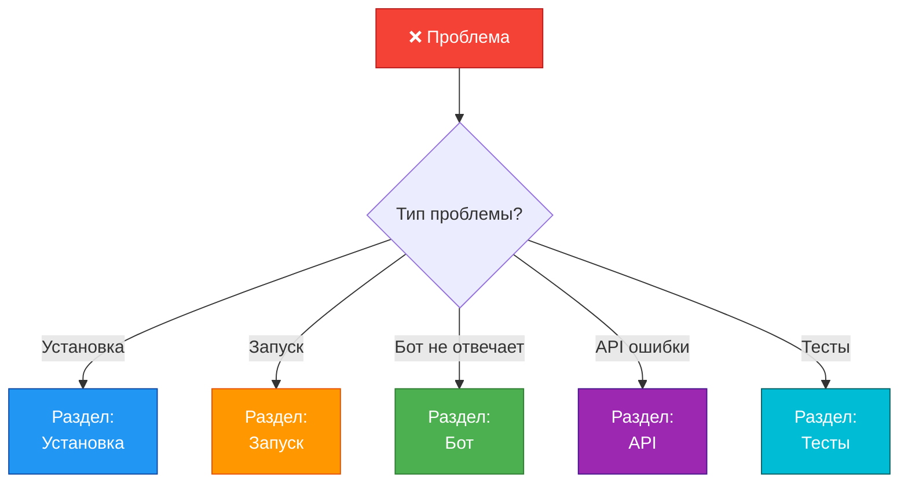
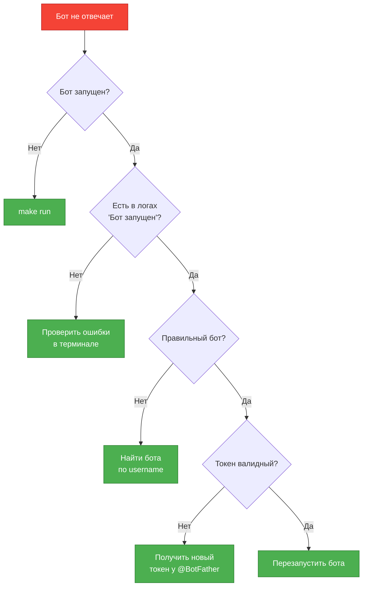
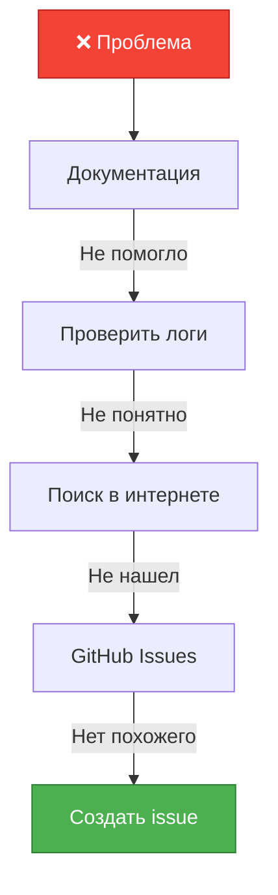

# 🐛 Troubleshooting - Решение проблем

Справочник по решению частых проблем при работе с LLM-ассистентом.

---

## 📋 Диагностика проблем

### Быстрая диагностика



---

## 🔧 Проблемы установки

### ❌ `uv: command not found`

**Причина:** uv не установлен или не добавлен в PATH

**Решение:**

```bash
# Windows (PowerShell)
powershell -c "irm https://astral.sh/uv/install.ps1 | iex"

# macOS/Linux
curl -LsSf https://astral.sh/uv/install.sh | sh

# Перезапусти терминал
exit
# Открой новый терминал

# Проверь
uv --version
```

**Если не помогло (Windows):**
1. Найди где установлен uv: `%USERPROFILE%\.cargo\bin`
2. Добавь в PATH:
   - Win+R → `sysdm.cpl` → Advanced → Environment Variables
   - Добавь `C:\Users\<username>\.cargo\bin` в Path
3. Перезапусти терминал

---

### ❌ `Python 3.11 required, found 3.9`

**Причина:** Установлена старая версия Python

**Решение:**

```bash
# Скачать и установить Python 3.11+
# https://www.python.org/downloads/

# Проверить версию
python --version
# Должно быть: Python 3.11.x или выше

# Если несколько версий (Linux/macOS)
python3.11 --version
```

**Если несколько версий Python:**
```bash
# Использовать конкретную версию
uv venv --python 3.11
```

---

### ❌ `make: command not found`

**Причина:** make не установлен (обычно Windows)

**Решение 1: Установить make**
```bash
# Windows через chocolatey
choco install make

# Или через scoop
scoop install make
```

**Решение 2: Использовать команды напрямую**
```bash
# Вместо: make install
uv sync

# Вместо: make run
uv run python src/main.py

# Вместо: make test
uv run pytest
```

---

### ❌ `Failed to install dependencies`

**Причина:** Проблемы с сетью или версиями пакетов

**Решение:**

```bash
# 1. Очистить кэш uv
uv cache clean

# 2. Попробовать снова
uv sync

# 3. Если не помогло - явно указать dependencies
uv pip install aiogram openai python-dotenv

# 4. Проверить установку
uv pip list
```

**Если ошибка с определенным пакетом:**
```bash
# Установить проблемный пакет отдельно
uv pip install aiogram --upgrade
```

---

## 🚀 Проблемы запуска

### ❌ `ValueError: TELEGRAM_BOT_TOKEN не установлен`

**Причина:** Отсутствует `.env` файл или токен не заполнен

**Решение:**

```bash
# 1. Проверить наличие .env
ls .env
# Или на Windows
dir .env

# 2. Если нет - создать из шаблона
cp .env.example .env  # Linux/macOS
copy .env.example .env  # Windows

# 3. Открыть .env и заполнить
notepad .env  # Windows
nano .env     # Linux
vim .env      # macOS

# 4. Убедиться что токен полный
TELEGRAM_BOT_TOKEN=1234567890:ABCdefGHIjklMNOpqrsTUVwxyz
```

**Проверка токена:**
- Должен начинаться с цифр
- Содержит двоеточие `:`
- После двоеточия - буквы и цифры
- Нет пробелов в начале/конце

---

### ❌ `ValueError: OPENROUTER_API_KEY не установлен`

**Причина:** Не заполнен ключ OpenRouter

**Решение:**

```bash
# 1. Получить ключ
# Перейти на https://openrouter.ai
# Settings → API Keys → Create new key

# 2. Добавить в .env
OPENROUTER_API_KEY=sk-or-v1-...

# 3. Проверить что ключ скопирован полностью
# Должен начинаться с: sk-or-v1-
```

**Проверка работоспособности ключа:**
```bash
curl https://openrouter.ai/api/v1/models \
  -H "Authorization: Bearer YOUR_KEY"
# Должен вернуть список моделей
```

---

### ❌ `ModuleNotFoundError: No module named 'src'`

**Причина:** Запуск из неправильной директории или venv не активирован

**Решение:**

```bash
# 1. Проверить текущую директорию
pwd  # Linux/macOS
cd   # Windows

# Должен быть: /path/to/systech-aidd-test

# 2. Если нет - перейти в корень проекта
cd /path/to/systech-aidd-test

# 3. Запустить через uv (рекомендуется)
uv run python src/main.py

# Или активировать venv
source .venv/bin/activate  # Linux/macOS
.venv\Scripts\activate     # Windows
python src/main.py
```

---

### ❌ `FileNotFoundError: [Errno 2] No such file 'prompts/system_prompt_xxx.txt'`

**Причина:** Указан несуществующий файл промпта

**Решение:**

```bash
# 1. Проверить какие промпты есть
ls prompts/

# Ожидается:
# - system_prompt.txt
# - system_prompt_python_code_reviewer.txt
# - system_prompt_technical_writer.txt

# 2. Исправить .env
SYSTEM_PROMPT_FILE=prompts/system_prompt.txt

# Или убрать эту строку (будет использован дефолтный промпт)
```

---

## 🤖 Проблемы с ботом

### ❌ Бот не отвечает на `/start`

**Диагностика:**



**Пошаговая проверка:**

```bash
# 1. Проверить что бот запущен
# В терминале должна быть строка:
# "🚀 Бот запущен! Нажмите Ctrl+C для остановки"

# 2. Проверить логи на ошибки
# Если есть красные ERROR строки - читать их

# 3. Проверить токен
# Получить информацию о боте
curl https://api.telegram.org/bot<YOUR_TOKEN>/getMe
# Должен вернуть информацию о боте

# 4. Если токен невалидный - получить новый
# @BotFather → /mybots → выбрать бота → API Token
```

---

### ❌ Бот получает сообщения, но не отвечает

**Причина:** Ошибка при обработке сообщения

**Диагностика:**

```bash
# 1. Смотреть логи в реальном времени
make run

# 2. Отправить сообщение боту

# 3. Искать в логах:
# - "Получено сообщение от user ..." - сообщение получено ✅
# - "ERROR" - ошибка при обработке ❌

# Типичные ошибки:
# - "API Error" → проблема с OpenRouter
# - "Rate limit" → превышен лимит запросов
# - "Invalid model" → неверная модель в .env
```

**Решение на основе ошибки:**

```bash
# Если "API Error: Invalid API key"
# → Проверить OPENROUTER_API_KEY в .env

# Если "API Error: Rate limit exceeded"
# → Подождать 1-2 минуты, попробовать снова

# Если "API Error: Model not found"
# → Проверить DEFAULT_MODEL в .env
# Должно быть: openai/gpt-3.5-turbo

# Если другая ошибка
# → Скопировать полный текст ошибки и искать в интернете
```

---

### ❌ Бот отвечает, но контекст не сохраняется

**Причина:** История не добавляется или очищается

**Диагностика:**

```bash
# 1. Отправить несколько связанных сообщений
User: Меня зовут Иван
Bot: [ответ]
User: Как меня зовут?
Bot: [должен ответить "Иван"]

# 2. Если не помнит - проверить логи
# Искать строки:
# - "add_message" - добавление в историю
# - "add_response" - добавление ответа

# 3. Проверить MAX_HISTORY_MESSAGES
cat .env | grep MAX_HISTORY
# Должно быть: 10 (по умолчанию)
```

**Решение:**

```bash
# 1. Проверить что история не очищается
# Не использовать /clear между сообщениями

# 2. Проверить что бот не перезапускается
# (История в памяти, теряется при перезапуске)

# 3. Убедиться что используется один user_id
# (Каждый пользователь имеет свою историю)
```

---

### ❌ Бот отвечает "❌ Извините, произошла ошибка"

**Причина:** Исключение при обработке сообщения

**Что делать:**

```bash
# 1. ОБЯЗАТЕЛЬНО смотреть логи в терминале
# Там будет детальная ошибка с traceback

# 2. Типичные причины:
# - Проблема с OpenRouter API
# - Сетевая ошибка
# - Превышен лимит токенов

# 3. Временное решение
# Использовать /clear и попробовать снова

# 4. Если повторяется
# → Проверить баланс на openrouter.ai
# → Проверить статус API: https://status.openrouter.ai
```

---

## 🌐 Проблемы с API

### ❌ `API Error: Rate limit exceeded`

**Причина:** Превышен лимит запросов OpenRouter

**Решение:**

```bash
# 1. Подождать 1-2 минуты

# 2. Проверить лимиты на openrouter.ai
# Settings → Usage & Billing

# 3. Если бесплатный план - ограничения:
# - ~5 запросов в минуту
# - ~200 запросов в день

# 4. Временное решение:
# Отправлять сообщения реже

# 5. Долгосрочное решение:
# Пополнить баланс на openrouter.ai
```

---

### ❌ `API Error: Invalid model: openai/gpt-3.5-turbo`

**Причина:** Модель недоступна или неправильно указана

**Решение:**

```bash
# 1. Проверить список доступных моделей
curl https://openrouter.ai/api/v1/models \
  -H "Authorization: Bearer YOUR_KEY"

# 2. Проверить .env
cat .env | grep DEFAULT_MODEL

# Правильные варианты:
# DEFAULT_MODEL=openai/gpt-3.5-turbo
# DEFAULT_MODEL=openai/gpt-4
# DEFAULT_MODEL=anthropic/claude-2

# 3. Исправить если неправильно
nano .env

# 4. Перезапустить бота
```

---

### ❌ `Connection timeout` / `Network error`

**Причина:** Проблемы с сетью или OpenRouter недоступен

**Решение:**

```bash
# 1. Проверить интернет
ping google.com

# 2. Проверить доступность OpenRouter
curl https://openrouter.ai
# Должен вернуть HTML страницу

# 3. Проверить статус API
# https://status.openrouter.ai

# 4. Если API недоступен
# → Подождать восстановления сервиса

# 5. Если интернет есть, но API не работает
# → Проверить firewall/proxy
# → Попробовать с другой сети
```

---

## 🧪 Проблемы с тестами

### ❌ `pytest: command not found`

**Причина:** pytest не установлен или venv не активирован

**Решение:**

```bash
# 1. Установить dev зависимости
uv sync --dev

# 2. Запустить через uv
uv run pytest

# Или через make
make test
```

---

### ❌ Тесты падают: `FAILED tests/test_*.py`

**Причина:** Изменения в коде сломали тесты

**Диагностика:**

```bash
# 1. Запустить тесты с verbose
uv run pytest -v

# 2. Найти первый упавший тест
# FAILED tests/test_config.py::test_config_valid

# 3. Запустить только этот тест
uv run pytest tests/test_config.py::test_config_valid -v

# 4. Читать вывод:
# - AssertionError → неверное ожидание
# - AttributeError → изменился интерфейс класса
# - ImportError → проблема с импортами
```

**Решение:**

```bash
# Если изменил код - обновить тест
# Если не менял код - откатить изменения

# Запустить все тесты снова
make test
```

---

### ❌ Low coverage: `Coverage: 75%`

**Причина:** Добавлен код без тестов

**Решение:**

```bash
# 1. Посмотреть какие строки не покрыты
uv run pytest --cov=src --cov-report=term-missing

# 2. Найти модуль с низким coverage
# Например: src/my_module.py 75%

# 3. Посмотреть конкретные строки
# Missing: 45-50, 67-70

# 4. Добавить тесты для этих строк
# tests/test_my_module.py

# 5. Запустить снова
make test
```

---

### ❌ `mypy: error: Name 'X' is not defined`

**Причина:** Отсутствует type hint или импорт

**Решение:**

```bash
# 1. Посмотреть все ошибки mypy
make typecheck

# 2. Для каждой ошибки:
# src/my_module.py:45: error: Name 'MyClass' is not defined

# 3. Добавить импорт
from src.models import MyClass

# Или добавить type hint
def my_func() -> str:  # Добавить -> str
    return "hello"

# 4. Проверить снова
make typecheck
```

---

## 🔍 Отладка (Debugging)

### Добавить детальное логирование

```python
# В любом файле src/
import logging
logger = logging.getLogger(__name__)

# Добавить debug логи
logger.debug(f"Debug info: {variable}")
logger.info(f"Info: {something}")
logger.error(f"Error: {error}")
```

**Запустить с DEBUG уровнем:**

```bash
# В .env
LOG_LEVEL=DEBUG

# Перезапустить бота
make run

# Теперь будут видны все debug логи
```

---

### Использовать Python debugger

```python
# Добавить breakpoint в код
def my_function():
    import pdb; pdb.set_trace()  # Остановится здесь
    # ...

# Запустить бота
make run

# При срабатывании breakpoint:
# (Pdb) n  - next line
# (Pdb) s  - step into
# (Pdb) p variable  - print variable
# (Pdb) c  - continue
```

---

### Использовать VSCode debugger

```bash
# 1. Открыть VSCode/Cursor
# 2. Поставить breakpoint (F9) в нужной строке
# 3. F5 → "▶️ Run Bot"
# 4. Отладчик остановится на breakpoint
# 5. F10 - step over, F11 - step into
```

---

## 📊 Проверка работоспособности

### Комплексная проверка

```bash
# 1. Проверка конфигурации
uv run python -c "from src.config import Config; c = Config(); print('✅ Config OK')"

# 2. Проверка импортов
uv run python -c "from src.main import main; print('✅ Imports OK')"

# 3. Проверка зависимостей
uv pip list

# 4. Проверка качества кода
make quality
# Должно быть все ✅

# 5. Проверка запуска
make run
# Должна быть строка: "🚀 Бот запущен!"

# 6. Проверка в Telegram
# /start → должен ответить

# ✅ Все работает!
```

---

## 🆘 Получить помощь

### Где искать решение



### 1. Проверить документацию

- [README.md](../README.md) - основная документация
- [getting-started.md](getting-started.md) - быстрый старт
- [architecture-overview.md](architecture-overview.md) - архитектура
- [codebase-tour.md](codebase-tour.md) - структура кода

### 2. Проверить логи

```bash
# Запустить с детальными логами
LOG_LEVEL=DEBUG make run

# Искать ERROR строки
# Копировать полный traceback
```

### 3. Поиск в интернете

```
# Шаблон поиска:
"[название ошибки]" python aiogram openrouter

# Примеры:
"Rate limit exceeded" openrouter
"ModuleNotFoundError" python
"Token is invalid" telegram bot
```

### 4. GitHub Issues

```bash
# Проверить существующие issues
https://github.com/<your-repo>/issues

# Искать по ключевым словам
# Возможно проблема уже решена
```

### 5. Создать issue

**Шаблон issue:**

```markdown
## Описание проблемы
[Что именно не работает]

## Шаги для воспроизведения
1. ...
2. ...
3. ...

## Ожидаемое поведение
[Что должно было произойти]

## Текущее поведение
[Что произошло на самом деле]

## Логи
```
[Вставить логи с ERROR]
```

## Окружение
- ОС: Windows 10 / macOS 14 / Ubuntu 22.04
- Python версия: 3.11.5
- uv версия: 0.x.x

## Дополнительный контекст
[Скриншоты, файлы конфигурации (без токенов!)]
```

---

## 📝 Чек-лист перед обращением за помощью

- [ ] Прочитал [troubleshooting.md](troubleshooting.md)
- [ ] Проверил логи на наличие ошибок
- [ ] Попробовал решения из этого документа
- [ ] Перезапустил бота
- [ ] Проверил `.env` файл (токены заполнены)
- [ ] Запустил `make quality` (все проверки passed)
- [ ] Искал в интернете по тексту ошибки
- [ ] Проверил существующие GitHub issues

**Только после этого создавать issue!**

---

## 🎯 Частые ошибки новичков

| Ошибка | Причина | Решение |
|--------|---------|---------|
| Бот не запускается | Нет `.env` | `cp .env.example .env` |
| `command not found` | Команда не в PATH | Переустановить / добавить в PATH |
| Бот не отвечает | Неверный токен | Получить новый у @BotFather |
| API ошибки | Нет баланса | Пополнить на openrouter.ai |
| Тесты падают | Изменил код | Обновить тесты |
| Low coverage | Нет тестов | Добавить тесты |
| Import ошибки | Не та директория | `cd` в корень проекта |
| Нет логов | Уровень ERROR | `LOG_LEVEL=DEBUG` |

---

**Проблема не решена?** Создай issue на GitHub с детальным описанием и логами.

**Нашел решение?** Поделись им через Pull Request в этот документ!
