# 🎨 Visual Guide - Визуальный гайд проекта

Полная визуализация LLM-ассистента с разных точек зрения через Mermaid диаграммы.

---

## 📋 Содержание

1. [System Architecture View](#1-system-architecture-view) - Архитектура системы
2. [Component View](#2-component-view) - Компоненты
3. [Data Flow View](#3-data-flow-view) - Поток данных
4. [Sequence View](#4-sequence-view) - Временные последовательности
5. [State Machine View](#5-state-machine-view) - Машины состояний
6. [Class Diagram View](#6-class-diagram-view) - Структура классов
7. [Deployment View](#7-deployment-view) - Развертывание
8. [User Journey View](#8-user-journey-view) - Путь пользователя
9. [Error Handling View](#9-error-handling-view) - Обработка ошибок
10. [Development Workflow View](#10-development-workflow-view) - Процесс разработки
11. [Testing Strategy View](#11-testing-strategy-view) - Стратегия тестирования
12. [Configuration View](#12-configuration-view) - Конфигурация

---

## 1. System Architecture View

### 1.1 High-Level Architecture

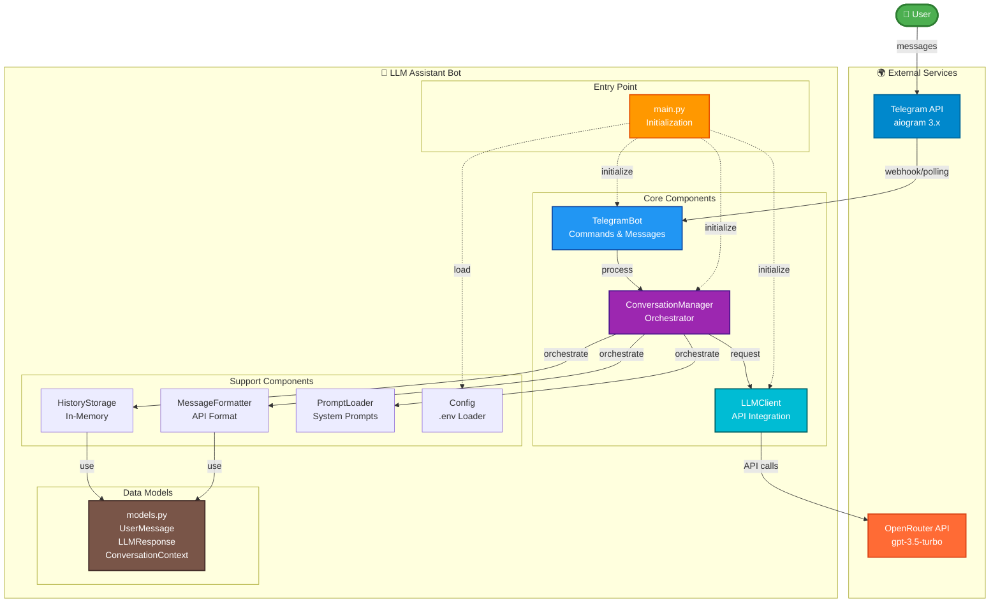
```mermaid
graph TB
    subgraph External["🌍 External Services"]
        TG[Telegram API<br/>aiogram 3.x]
        OR[OpenRouter API<br/>gpt-3.5-turbo]
    end

    subgraph Application["🤖 LLM Assistant Bot"]
        subgraph Entry["Entry Point"]
            Main[main.py<br/>Initialization]
        end

        subgraph Core["Core Components"]
            TB[TelegramBot<br/>Commands & Messages]
            CM[ConversationManager<br/>Orchestrator]
            LLM[LLMClient<br/>API Integration]
        end

        subgraph Support["Support Components"]
            HS[HistoryStorage<br/>In-Memory]
            MF[MessageFormatter<br/>API Format]
            PL[PromptLoader<br/>System Prompts]
            CFG[Config<br/>.env Loader]
        end

        subgraph Data["Data Models"]
            Models[models.py<br/>UserMessage<br/>LLMResponse<br/>ConversationContext]
        end
    end

    User([👤 User]) -->|messages| TG
    TG -->|webhook/polling| TB
    TB -->|process| CM
    CM -->|orchestrate| HS
    CM -->|orchestrate| MF
    CM -->|orchestrate| PL
    CM -->|request| LLM
    LLM -->|API calls| OR

    Main -.->|initialize| TB
    Main -.->|initialize| CM
    Main -.->|initialize| LLM
    Main -.->|load| CFG

    HS -->|use| Models
    MF -->|use| Models

    style User fill:#4CAF50,stroke:#2E7D32,stroke-width:3px,color:#fff
    style TG fill:#0088CC,stroke:#006699,stroke-width:2px,color:#fff
    style OR fill:#FF6B35,stroke:#D84315,stroke-width:2px,color:#fff
    style TB fill:#2196F3,stroke:#0D47A1,stroke-width:2px,color:#fff
    style CM fill:#9C27B0,stroke:#4A148C,stroke-width:2px,color:#fff
    style LLM fill:#00BCD4,stroke:#006064,stroke-width:2px,color:#fff
    style Main fill:#FF9800,stroke:#E65100,stroke-width:2px,color:#fff
    style Models fill:#795548,stroke:#3E2723,stroke-width:2px,color:#fff
```

### 1.2 System Context

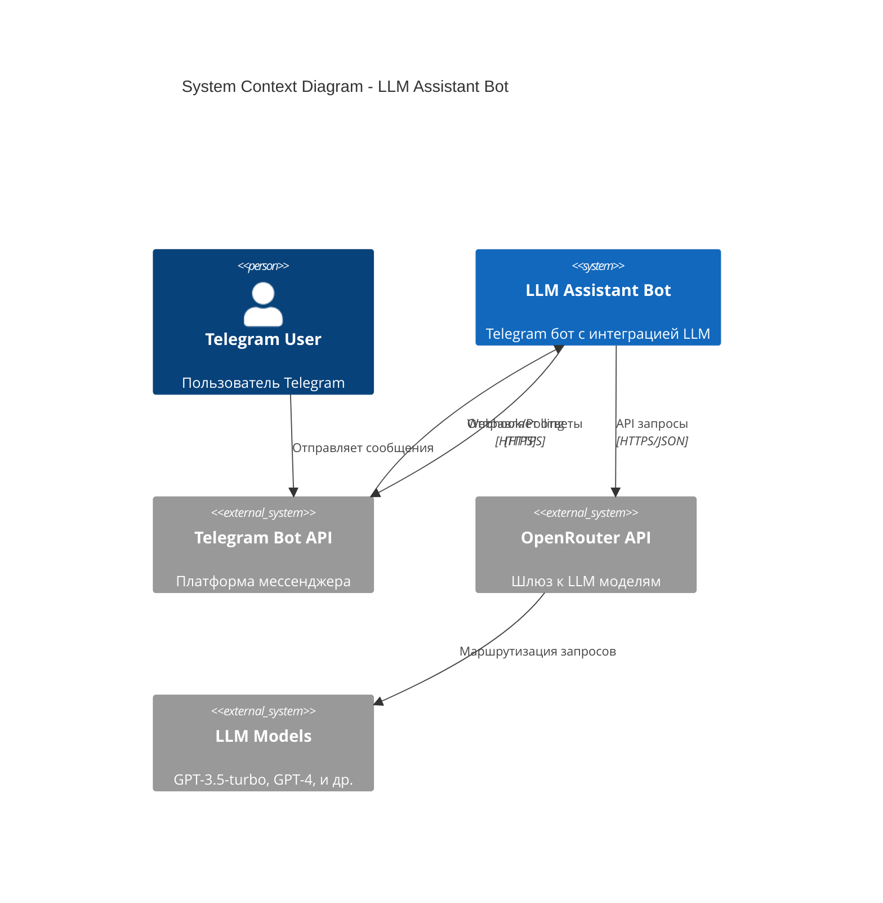
```mermaid
C4Context
    title System Context Diagram - LLM Assistant Bot

    Person(user, "Telegram User", "Пользователь Telegram")

    System(bot, "LLM Assistant Bot", "Telegram бот с интеграцией LLM")

    System_Ext(telegram, "Telegram Bot API", "Платформа мессенджера")
    System_Ext(openrouter, "OpenRouter API", "Шлюз к LLM моделям")
    System_Ext(llm, "LLM Models", "GPT-3.5-turbo, GPT-4, и др.")

    Rel(user, telegram, "Отправляет сообщения")
    Rel(telegram, bot, "Webhook/Polling", "HTTPS")
    Rel(bot, telegram, "Отправляет ответы", "HTTPS")
    Rel(bot, openrouter, "API запросы", "HTTPS/JSON")
    Rel(openrouter, llm, "Маршрутизация запросов")
```

---

## 2. Component View

### 2.1 Component Relationships

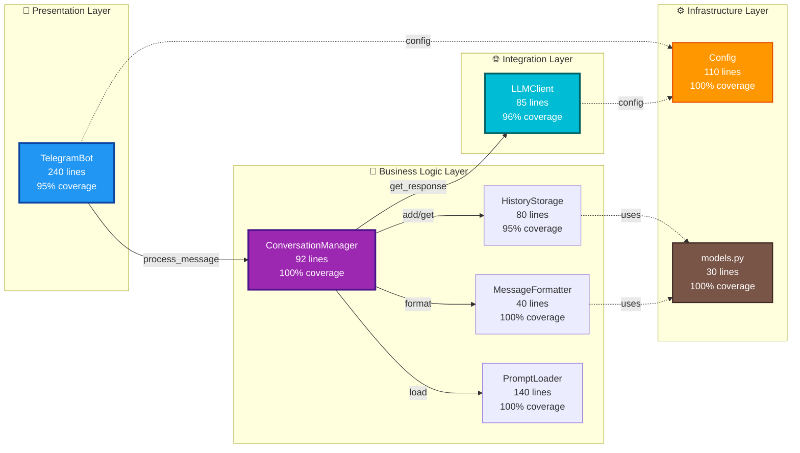
```mermaid
graph LR
    subgraph Presentation["🎨 Presentation Layer"]
        TB[TelegramBot<br/>240 lines<br/>95% coverage]
    end

    subgraph Business["🔧 Business Logic Layer"]
        CM[ConversationManager<br/>92 lines<br/>100% coverage]
        HS[HistoryStorage<br/>80 lines<br/>95% coverage]
        MF[MessageFormatter<br/>40 lines<br/>100% coverage]
        PL[PromptLoader<br/>140 lines<br/>100% coverage]
    end

    subgraph Integration["🌐 Integration Layer"]
        LLM[LLMClient<br/>85 lines<br/>96% coverage]
    end

    subgraph Infrastructure["⚙️ Infrastructure Layer"]
        CFG[Config<br/>110 lines<br/>100% coverage]
        Models[models.py<br/>30 lines<br/>100% coverage]
    end

    TB -->|process_message| CM
    CM -->|add/get| HS
    CM -->|format| MF
    CM -->|load| PL
    CM -->|get_response| LLM

    HS -.->|uses| Models
    MF -.->|uses| Models

    TB -.->|config| CFG
    LLM -.->|config| CFG

    style TB fill:#2196F3,stroke:#0D47A1,stroke-width:3px,color:#fff
    style CM fill:#9C27B0,stroke:#4A148C,stroke-width:3px,color:#fff
    style LLM fill:#00BCD4,stroke:#006064,stroke-width:3px,color:#fff
    style CFG fill:#FF9800,stroke:#E65100,stroke-width:2px,color:#fff
    style Models fill:#795548,stroke:#3E2723,stroke-width:2px,color:#fff
```

### 2.2 Component Dependency Graph

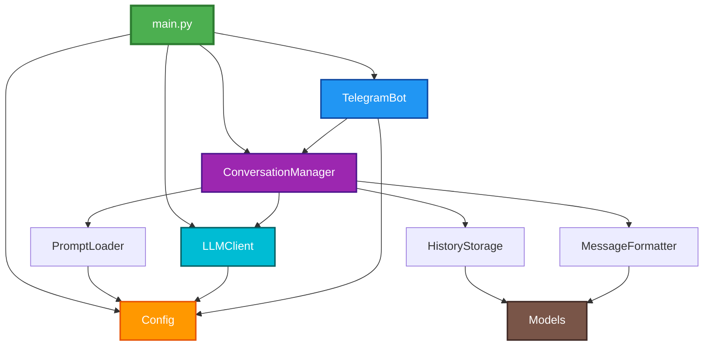
```mermaid
graph TD
    Main[main.py] --> Config
    Main --> TelegramBot
    Main --> ConversationManager
    Main --> LLMClient

    TelegramBot --> ConversationManager

    ConversationManager --> LLMClient
    ConversationManager --> HistoryStorage
    ConversationManager --> MessageFormatter
    ConversationManager --> PromptLoader

    HistoryStorage --> Models
    MessageFormatter --> Models
    PromptLoader --> Config

    LLMClient --> Config
    TelegramBot --> Config

    style Main fill:#4CAF50,stroke:#2E7D32,stroke-width:3px,color:#fff
    style Config fill:#FF9800,stroke:#E65100,stroke-width:2px,color:#fff
    style TelegramBot fill:#2196F3,stroke:#0D47A1,stroke-width:2px,color:#fff
    style ConversationManager fill:#9C27B0,stroke:#4A148C,stroke-width:2px,color:#fff
    style LLMClient fill:#00BCD4,stroke:#006064,stroke-width:2px,color:#fff
    style Models fill:#795548,stroke:#3E2723,stroke-width:2px,color:#fff
```

---

## 3. Data Flow View

### 3.1 Message Processing Flow (User → LLM)

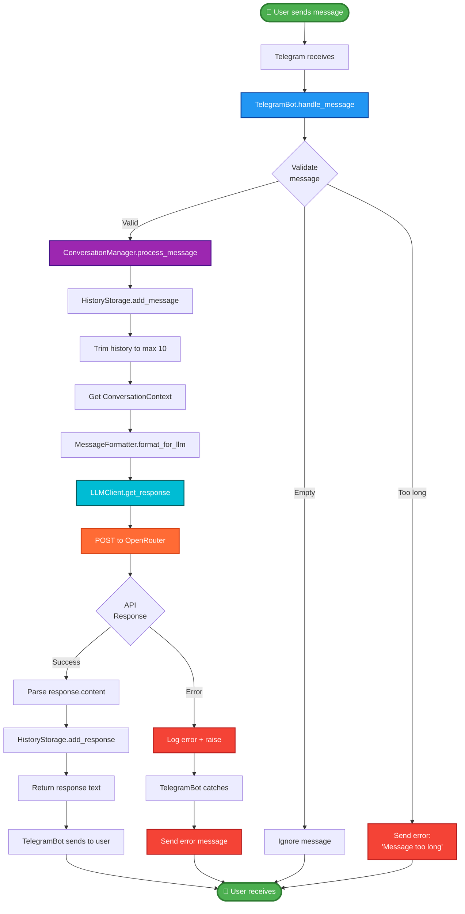
```mermaid
flowchart TB
    Start([👤 User sends message]) --> Telegram[Telegram receives]
    Telegram --> Bot[TelegramBot.handle_message]

    Bot --> Validate{Validate<br/>message}
    Validate -->|Empty| Ignore[Ignore message]
    Validate -->|Too long| Error1[Send error:<br/>'Message too long']
    Validate -->|Valid| Process[ConversationManager.process_message]

    Process --> AddMsg[HistoryStorage.add_message]
    AddMsg --> Trim[Trim history to max 10]
    Trim --> GetCtx[Get ConversationContext]
    GetCtx --> Format[MessageFormatter.format_for_llm]
    Format --> API[LLMClient.get_response]

    API --> Request[POST to OpenRouter]
    Request --> Response{API<br/>Response}
    Response -->|Success| Parse[Parse response.content]
    Response -->|Error| HandleError[Log error + raise]

    Parse --> AddResp[HistoryStorage.add_response]
    AddResp --> Return[Return response text]
    Return --> Send[TelegramBot sends to user]
    Send --> End([👤 User receives])

    HandleError --> Catch[TelegramBot catches]
    Catch --> Error2[Send error message]
    Error2 --> End

    Ignore --> End
    Error1 --> End

    style Start fill:#4CAF50,stroke:#2E7D32,stroke-width:3px,color:#fff
    style End fill:#4CAF50,stroke:#2E7D32,stroke-width:3px,color:#fff
    style Bot fill:#2196F3,stroke:#0D47A1,stroke-width:2px,color:#fff
    style Process fill:#9C27B0,stroke:#4A148C,stroke-width:2px,color:#fff
    style API fill:#00BCD4,stroke:#006064,stroke-width:2px,color:#fff
    style Request fill:#FF6B35,stroke:#D84315,stroke-width:2px,color:#fff
    style HandleError fill:#F44336,stroke:#B71C1C,stroke-width:2px,color:#fff
    style Error1 fill:#F44336,stroke:#B71C1C,stroke-width:2px,color:#fff
    style Error2 fill:#F44336,stroke:#B71C1C,stroke-width:2px,color:#fff
```

### 3.2 Data Transformation Pipeline

```mermaid
graph LR
    subgraph Input["📥 Input"]
        Raw[Raw Telegram Message<br/>{'text': 'Hello', 'from': {...}}]
    end

    subgraph Storage["💾 Storage"]
        UM[UserMessage<br/>dataclass<br/>user_id, text, timestamp]
        Ctx[ConversationContext<br/>messages: list<br/>responses: list]
    end

    subgraph Format["🔄 Formatting"]
        API[OpenAI API Format<br/>[{'role': 'user', 'content': '...'}]]
    end

    subgraph LLM["🤖 LLM"]
        Req[API Request<br/>model, messages, max_tokens]
        Resp[API Response<br/>choices[0].message.content]
    end

    subgraph Output["📤 Output"]
        LR[LLMResponse<br/>dataclass<br/>content, timestamp, model]
        Final[Telegram Message<br/>text to user]
    end

    Raw --> UM
    UM --> Ctx
    Ctx --> API
    API --> Req
    Req --> Resp
    Resp --> LR
    LR --> Ctx
    LR --> Final

    style Raw fill:#4CAF50,stroke:#2E7D32,stroke-width:2px,color:#fff
    style Final fill:#4CAF50,stroke:#2E7D32,stroke-width:2px,color:#fff
    style UM fill:#2196F3,stroke:#0D47A1,stroke-width:2px,color:#fff
    style Ctx fill:#9C27B0,stroke:#4A148C,stroke-width:2px,color:#fff
    style LR fill:#00BCD4,stroke:#006064,stroke-width:2px,color:#fff
    style Req fill:#FF9800,stroke:#E65100,stroke-width:2px,color:#fff
```

### 3.3 Context History Management

```mermaid
graph TD
    Start[New message arrives] --> Check{User context<br/>exists?}
    Check -->|No| Create[Create new<br/>ConversationContext]
    Check -->|Yes| Get[Get existing context]

    Create --> Add
    Get --> Add[Add UserMessage to context]

    Add --> Count{Messages<br/>count > 10?}
    Count -->|Yes| Trim[Trim to last 10]
    Count -->|No| Keep[Keep all]

    Trim --> Store
    Keep --> Store[Store in memory<br/>contexts[user_id]]

    Store --> Use[Use for LLM request]
    Use --> AddResp[Add LLMResponse]
    AddResp --> CountResp{Responses<br/>count > 10?}

    CountResp -->|Yes| TrimResp[Trim to last 10]
    CountResp -->|No| KeepResp[Keep all]

    TrimResp --> Done[Ready for next message]
    KeepResp --> Done

    style Start fill:#4CAF50,stroke:#2E7D32,stroke-width:2px,color:#fff
    style Create fill:#FF9800,stroke:#E65100,stroke-width:2px,color:#fff
    style Trim fill:#F44336,stroke:#B71C1C,stroke-width:2px,color:#fff
    style TrimResp fill:#F44336,stroke:#B71C1C,stroke-width:2px,color:#fff
    style Done fill:#4CAF50,stroke:#2E7D32,stroke-width:2px,color:#fff
```

---

## 4. Sequence View

### 4.1 Complete Message Processing Sequence

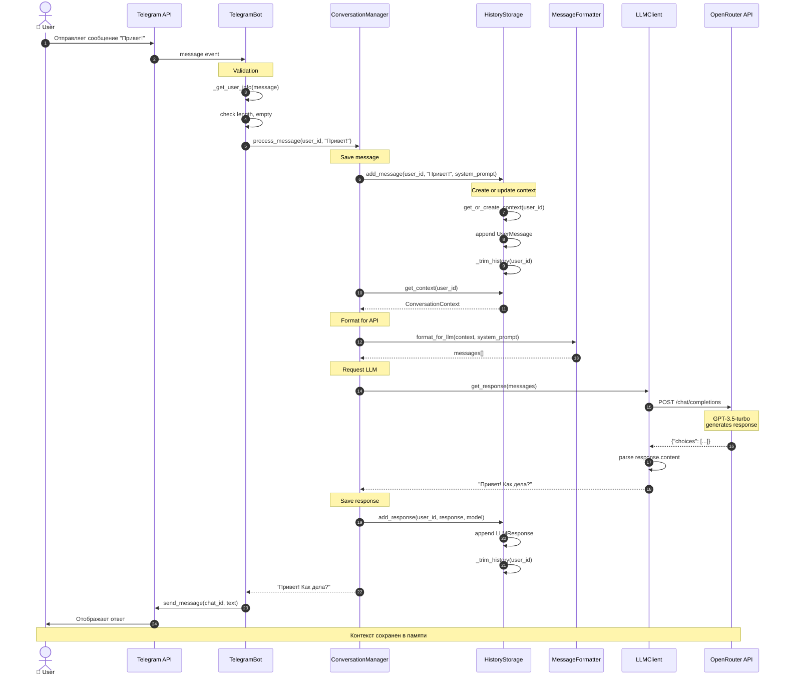
```mermaid
sequenceDiagram
    autonumber
    actor User as 👤 User
    participant TG as Telegram API
    participant TB as TelegramBot
    participant CM as ConversationManager
    participant HS as HistoryStorage
    participant MF as MessageFormatter
    participant LC as LLMClient
    participant OR as OpenRouter API

    User->>TG: Отправляет сообщение "Привет!"
    TG->>TB: message event

    Note over TB: Validation
    TB->>TB: _get_user_info(message)
    TB->>TB: check length, empty

    TB->>CM: process_message(user_id, "Привет!")

    Note over CM: Save message
    CM->>HS: add_message(user_id, "Привет!", system_prompt)

    Note over HS: Create or update context
    HS->>HS: get_or_create_context(user_id)
    HS->>HS: append UserMessage
    HS->>HS: _trim_history(user_id)

    CM->>HS: get_context(user_id)
    HS-->>CM: ConversationContext

    Note over CM: Format for API
    CM->>MF: format_for_llm(context, system_prompt)
    MF-->>CM: messages[]

    Note over CM: Request LLM
    CM->>LC: get_response(messages)
    LC->>OR: POST /chat/completions

    Note over OR: GPT-3.5-turbo<br/>generates response
    OR-->>LC: {"choices": [...]}

    LC->>LC: parse response.content
    LC-->>CM: "Привет! Как дела?"

    Note over CM: Save response
    CM->>HS: add_response(user_id, response, model)
    HS->>HS: append LLMResponse
    HS->>HS: _trim_history(user_id)

    CM-->>TB: "Привет! Как дела?"
    TB->>TG: send_message(chat_id, text)
    TG->>User: Отображает ответ

    Note over User,OR: Контекст сохранен в памяти
```

### 4.2 Bot Commands Sequence

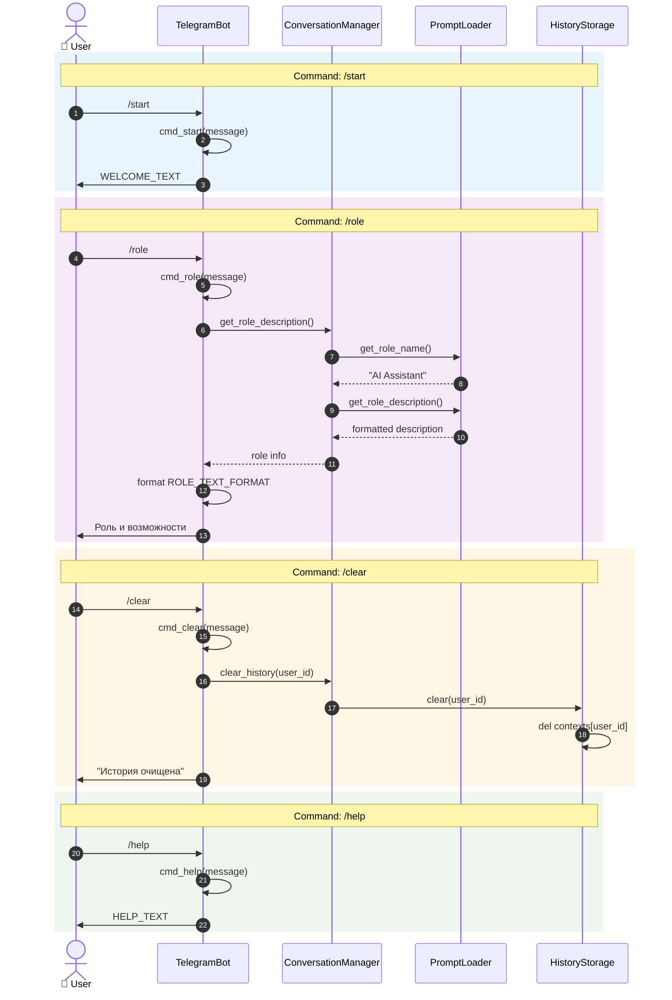
```mermaid
sequenceDiagram
    autonumber
    actor User as 👤 User
    participant Bot as TelegramBot
    participant CM as ConversationManager
    participant PL as PromptLoader
    participant HS as HistoryStorage

    rect rgb(33, 150, 243, 0.1)
        Note over User,HS: Command: /start
        User->>Bot: /start
        Bot->>Bot: cmd_start(message)
        Bot->>User: WELCOME_TEXT
    end

    rect rgb(156, 39, 176, 0.1)
        Note over User,HS: Command: /role
        User->>Bot: /role
        Bot->>Bot: cmd_role(message)
        Bot->>CM: get_role_description()
        CM->>PL: get_role_name()
        PL-->>CM: "AI Assistant"
        CM->>PL: get_role_description()
        PL-->>CM: formatted description
        CM-->>Bot: role info
        Bot->>Bot: format ROLE_TEXT_FORMAT
        Bot->>User: Роль и возможности
    end

    rect rgb(255, 152, 0, 0.1)
        Note over User,HS: Command: /clear
        User->>Bot: /clear
        Bot->>Bot: cmd_clear(message)
        Bot->>CM: clear_history(user_id)
        CM->>HS: clear(user_id)
        HS->>HS: del contexts[user_id]
        Bot->>User: "История очищена"
    end

    rect rgb(76, 175, 80, 0.1)
        Note over User,HS: Command: /help
        User->>Bot: /help
        Bot->>Bot: cmd_help(message)
        Bot->>User: HELP_TEXT
    end
```

### 4.3 Application Startup Sequence

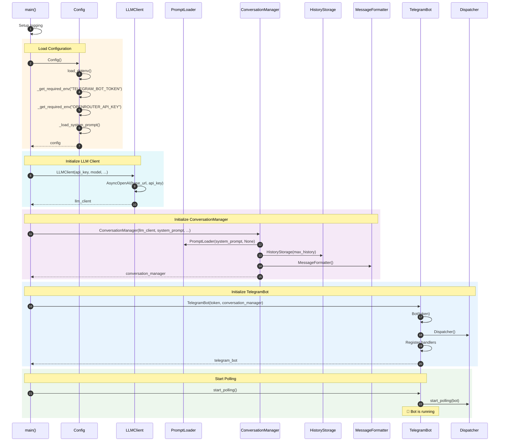
```mermaid
sequenceDiagram
    autonumber
    participant Main as main()
    participant Cfg as Config
    participant LC as LLMClient
    participant PL as PromptLoader
    participant CM as ConversationManager
    participant HS as HistoryStorage
    participant MF as MessageFormatter
    participant TB as TelegramBot
    participant Disp as Dispatcher

    Main->>Main: Setup logging

    rect rgb(255, 152, 0, 0.1)
        Note over Main,Cfg: Load Configuration
        Main->>Cfg: Config()
        Cfg->>Cfg: load_dotenv()
        Cfg->>Cfg: _get_required_env("TELEGRAM_BOT_TOKEN")
        Cfg->>Cfg: _get_required_env("OPENROUTER_API_KEY")
        Cfg->>Cfg: _load_system_prompt()
        Cfg-->>Main: config
    end

    rect rgb(0, 188, 212, 0.1)
        Note over Main,LC: Initialize LLM Client
        Main->>LC: LLMClient(api_key, model, ...)
        LC->>LC: AsyncOpenAI(base_url, api_key)
        LC-->>Main: llm_client
    end

    rect rgb(156, 39, 176, 0.1)
        Note over Main,MF: Initialize ConversationManager
        Main->>CM: ConversationManager(llm_client, system_prompt, ...)
        CM->>PL: PromptLoader(system_prompt, None)
        CM->>HS: HistoryStorage(max_history)
        CM->>MF: MessageFormatter()
        CM-->>Main: conversation_manager
    end

    rect rgb(33, 150, 243, 0.1)
        Note over Main,Disp: Initialize TelegramBot
        Main->>TB: TelegramBot(token, conversation_manager)
        TB->>TB: Bot(token)
        TB->>Disp: Dispatcher()
        TB->>TB: Register handlers
        TB-->>Main: telegram_bot
    end

    rect rgb(76, 175, 80, 0.1)
        Note over Main,TB: Start Polling
        Main->>TB: start_polling()
        TB->>Disp: start_polling(bot)
        Note over TB: 🚀 Bot is running
    end
```

---

## 5. State Machine View

### 5.1 Conversation Context Lifecycle

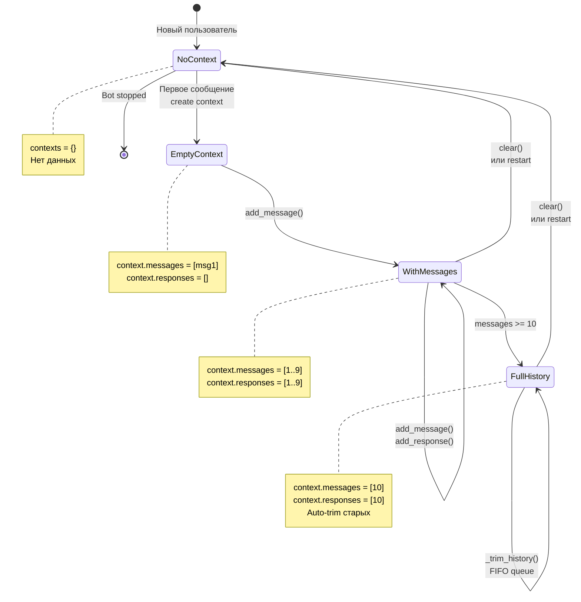
```mermaid
stateDiagram-v2
    [*] --> NoContext: Новый пользователь

    NoContext --> EmptyContext: Первое сообщение<br/>create context
    EmptyContext --> WithMessages: add_message()

    WithMessages --> WithMessages: add_message()<br/>add_response()

    WithMessages --> FullHistory: messages >= 10
    FullHistory --> FullHistory: _trim_history()<br/>FIFO queue

    WithMessages --> NoContext: clear()<br/>или restart
    FullHistory --> NoContext: clear()<br/>или restart

    NoContext --> [*]: Bot stopped

    note right of NoContext
        contexts = {}
        Нет данных
    end note

    note right of EmptyContext
        context.messages = [msg1]
        context.responses = []
    end note

    note right of WithMessages
        context.messages = [1..9]
        context.responses = [1..9]
    end note

    note right of FullHistory
        context.messages = [10]
        context.responses = [10]
        Auto-trim старых
    end note
```

### 5.2 Message Processing States

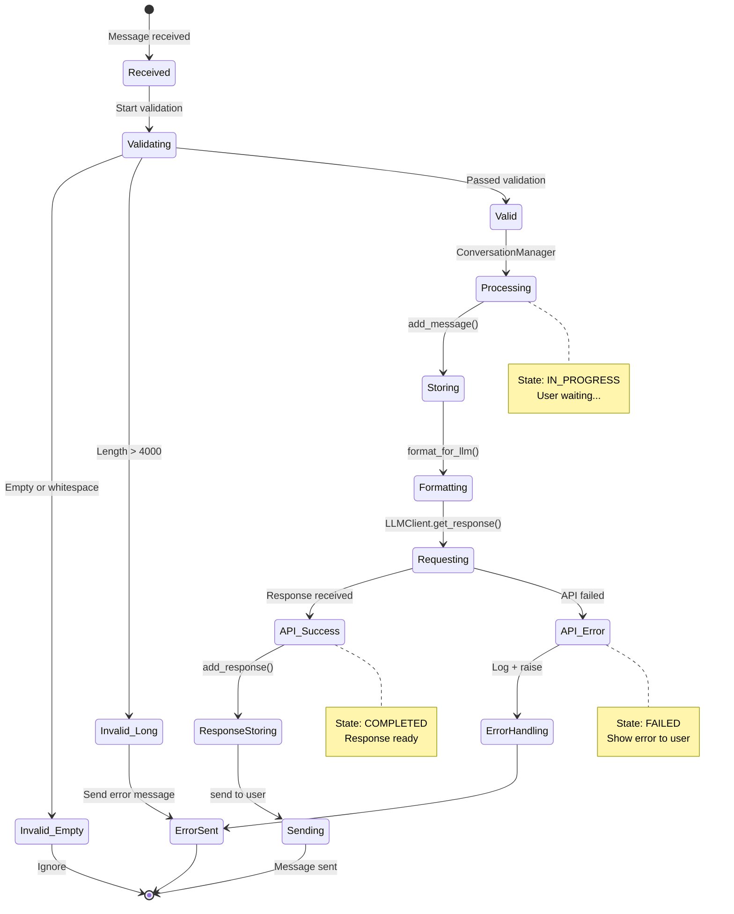
```mermaid
stateDiagram-v2
    [*] --> Received: Message received

    Received --> Validating: Start validation

    Validating --> Invalid_Empty: Empty or whitespace
    Validating --> Invalid_Long: Length > 4000
    Validating --> Valid: Passed validation

    Invalid_Empty --> [*]: Ignore
    Invalid_Long --> ErrorSent: Send error message
    ErrorSent --> [*]

    Valid --> Processing: ConversationManager

    Processing --> Storing: add_message()
    Storing --> Formatting: format_for_llm()
    Formatting --> Requesting: LLMClient.get_response()

    Requesting --> API_Success: Response received
    Requesting --> API_Error: API failed

    API_Error --> ErrorHandling: Log + raise
    ErrorHandling --> ErrorSent

    API_Success --> ResponseStoring: add_response()
    ResponseStoring --> Sending: send to user
    Sending --> [*]: Message sent

    note right of Processing
        State: IN_PROGRESS
        User waiting...
    end note

    note right of API_Success
        State: COMPLETED
        Response ready
    end note

    note right of API_Error
        State: FAILED
        Show error to user
    end note
```

### 5.3 Bot Lifecycle States

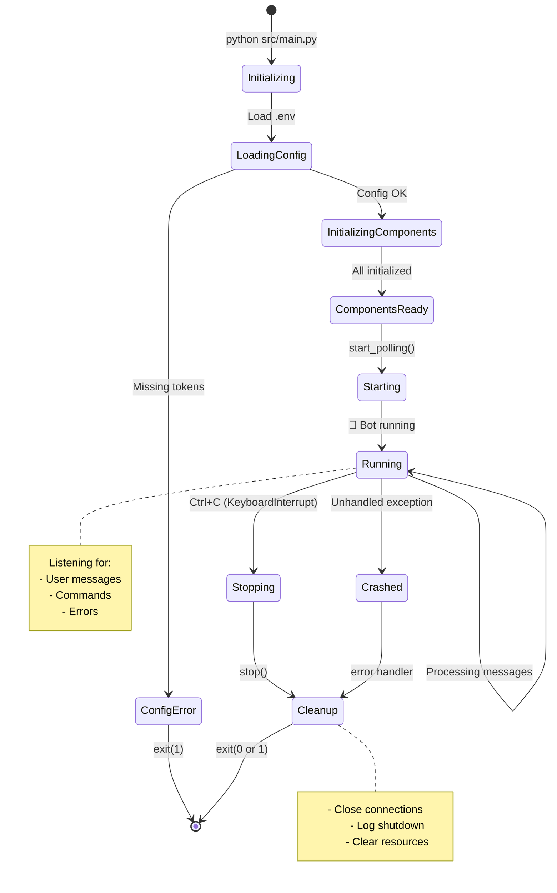
```mermaid
stateDiagram-v2
    [*] --> Initializing: python src/main.py

    Initializing --> LoadingConfig: Load .env
    LoadingConfig --> ConfigError: Missing tokens
    LoadingConfig --> InitializingComponents: Config OK

    ConfigError --> [*]: exit(1)

    InitializingComponents --> ComponentsReady: All initialized
    ComponentsReady --> Starting: start_polling()

    Starting --> Running: 🚀 Bot running

    Running --> Running: Processing messages
    Running --> Stopping: Ctrl+C (KeyboardInterrupt)
    Running --> Crashed: Unhandled exception

    Stopping --> Cleanup: stop()
    Crashed --> Cleanup: error handler

    Cleanup --> [*]: exit(0 or 1)

    note right of Running
        Listening for:
        - User messages
        - Commands
        - Errors
    end note

    note right of Cleanup
        - Close connections
        - Log shutdown
        - Clear resources
    end note
```

---

## 6. Class Diagram View

### 6.1 Core Classes Structure

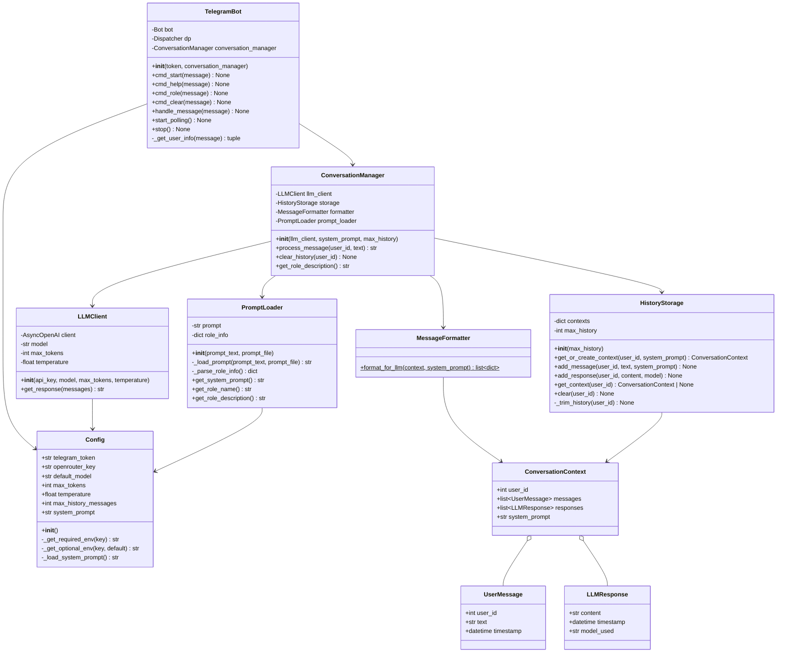
```mermaid
classDiagram
    class Config {
        +str telegram_token
        +str openrouter_key
        +str default_model
        +int max_tokens
        +float temperature
        +int max_history_messages
        +str system_prompt
        +__init__()
        -_get_required_env(key) str
        -_get_optional_env(key, default) str
        -_load_system_prompt() str
    }

    class UserMessage {
        +int user_id
        +str text
        +datetime timestamp
    }

    class LLMResponse {
        +str content
        +datetime timestamp
        +str model_used
    }

    class ConversationContext {
        +int user_id
        +list~UserMessage~ messages
        +list~LLMResponse~ responses
        +str system_prompt
    }

    class HistoryStorage {
        -dict contexts
        -int max_history
        +__init__(max_history)
        +get_or_create_context(user_id, system_prompt) ConversationContext
        +add_message(user_id, text, system_prompt) None
        +add_response(user_id, content, model) None
        +get_context(user_id) ConversationContext | None
        +clear(user_id) None
        -_trim_history(user_id) None
    }

    class MessageFormatter {
        +format_for_llm(context, system_prompt)$ list~dict~
    }

    class PromptLoader {
        -str prompt
        -dict role_info
        +__init__(prompt_text, prompt_file)
        -_load_prompt(prompt_text, prompt_file) str
        -_parse_role_info() dict
        +get_system_prompt() str
        +get_role_name() str
        +get_role_description() str
    }

    class LLMClient {
        -AsyncOpenAI client
        -str model
        -int max_tokens
        -float temperature
        +__init__(api_key, model, max_tokens, temperature)
        +get_response(messages) str
    }

    class ConversationManager {
        -LLMClient llm_client
        -HistoryStorage storage
        -MessageFormatter formatter
        -PromptLoader prompt_loader
        +__init__(llm_client, system_prompt, max_history)
        +process_message(user_id, text) str
        +clear_history(user_id) None
        +get_role_description() str
    }

    class TelegramBot {
        -Bot bot
        -Dispatcher dp
        -ConversationManager conversation_manager
        +__init__(token, conversation_manager)
        +cmd_start(message) None
        +cmd_help(message) None
        +cmd_role(message) None
        +cmd_clear(message) None
        +handle_message(message) None
        +start_polling() None
        +stop() None
        -_get_user_info(message) tuple
    }

    ConversationContext o-- UserMessage
    ConversationContext o-- LLMResponse
    HistoryStorage --> ConversationContext
    MessageFormatter --> ConversationContext
    ConversationManager --> LLMClient
    ConversationManager --> HistoryStorage
    ConversationManager --> MessageFormatter
    ConversationManager --> PromptLoader
    TelegramBot --> ConversationManager
    PromptLoader --> Config
    LLMClient --> Config
    TelegramBot --> Config
```

### 6.2 Inheritance and Interfaces

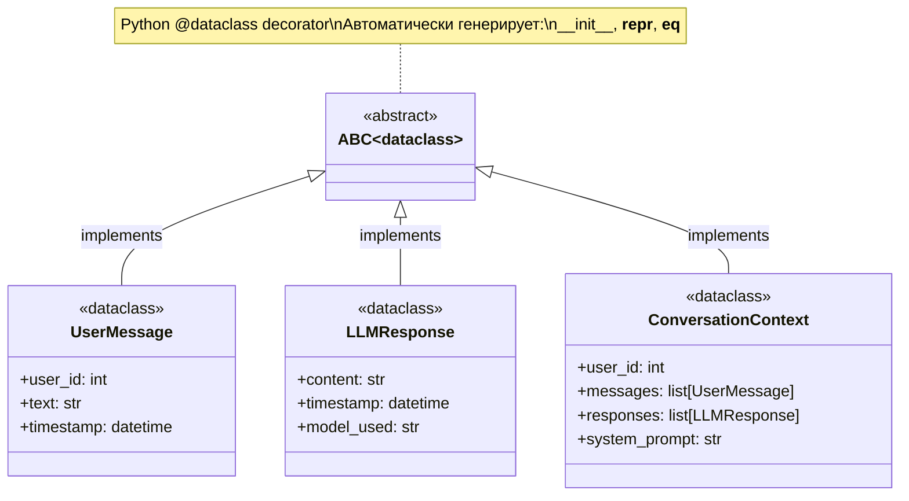
```mermaid
classDiagram
    class ABC~dataclass~ {
        <<abstract>>
    }

    class UserMessage {
        <<dataclass>>
        +user_id: int
        +text: str
        +timestamp: datetime
    }

    class LLMResponse {
        <<dataclass>>
        +content: str
        +timestamp: datetime
        +model_used: str
    }

    class ConversationContext {
        <<dataclass>>
        +user_id: int
        +messages: list[UserMessage]
        +responses: list[LLMResponse]
        +system_prompt: str
    }

    ABC <|-- UserMessage: implements
    ABC <|-- LLMResponse: implements
    ABC <|-- ConversationContext: implements

    note for ABC "Python @dataclass decorator\nАвтоматически генерирует:\n__init__, __repr__, __eq__"
```

---

## 7. Deployment View

### 7.1 Deployment Architecture

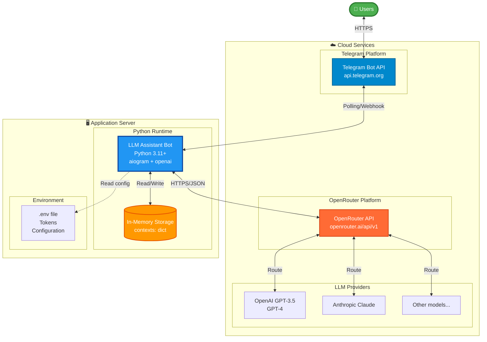
```mermaid
graph TB
    subgraph Cloud["☁️ Cloud Services"]
        subgraph Telegram["Telegram Platform"]
            TAPI[Telegram Bot API<br/>api.telegram.org]
        end

        subgraph OpenRouter["OpenRouter Platform"]
            ORAPI[OpenRouter API<br/>openrouter.ai/api/v1]
        end

        subgraph LLM["LLM Providers"]
            GPT[OpenAI GPT-3.5<br/>GPT-4]
            Claude[Anthropic Claude]
            Others[Other models...]
        end
    end

    subgraph Server["🖥️ Application Server"]
        subgraph Runtime["Python Runtime"]
            Bot[LLM Assistant Bot<br/>Python 3.11+<br/>aiogram + openai]
            Memory[(In-Memory Storage<br/>contexts: dict)]
        end

        subgraph Env["Environment"]
            ENV[.env file<br/>Tokens<br/>Configuration]
        end
    end

    User([👤 Users]) <-->|HTTPS| TAPI
    TAPI <-->|Polling/Webhook| Bot
    Bot <-->|HTTPS/JSON| ORAPI
    ORAPI <-->|Route| GPT
    ORAPI <-->|Route| Claude
    ORAPI <-->|Route| Others
    Bot -.->|Read config| ENV
    Bot <-->|Read/Write| Memory

    style User fill:#4CAF50,stroke:#2E7D32,stroke-width:3px,color:#fff
    style Bot fill:#2196F3,stroke:#0D47A1,stroke-width:3px,color:#fff
    style Memory fill:#FF9800,stroke:#E65100,stroke-width:2px,color:#fff
    style TAPI fill:#0088CC,stroke:#006699,stroke-width:2px,color:#fff
    style ORAPI fill:#FF6B35,stroke:#D84315,stroke-width:2px,color:#fff
```

### 7.2 Runtime Environment

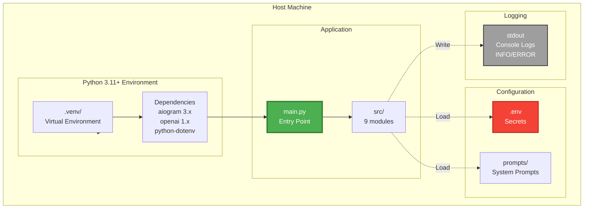
```mermaid
graph TD
    subgraph Host["Host Machine"]
        subgraph Python["Python 3.11+ Environment"]
            VEnv[.venv/<br/>Virtual Environment]
            Deps[Dependencies<br/>aiogram 3.x<br/>openai 1.x<br/>python-dotenv]
        end

        subgraph App["Application"]
            Main[main.py<br/>Entry Point]
            Src[src/<br/>9 modules]
        end

        subgraph Config["Configuration"]
            EnvFile[.env<br/>Secrets]
            Prompts[prompts/<br/>System Prompts]
        end

        subgraph Logs["Logging"]
            Stdout[stdout<br/>Console Logs<br/>INFO/ERROR]
        end
    end

    Python --> VEnv
    VEnv --> Deps
    Deps --> Main
    Main --> Src
    Src -.->|Load| EnvFile
    Src -.->|Load| Prompts
    Src -.->|Write| Stdout

    style Main fill:#4CAF50,stroke:#2E7D32,stroke-width:3px,color:#fff
    style EnvFile fill:#F44336,stroke:#B71C1C,stroke-width:2px,color:#fff
    style Stdout fill:#9E9E9E,stroke:#424242,stroke-width:2px,color:#fff
```

### 7.3 Network Communication

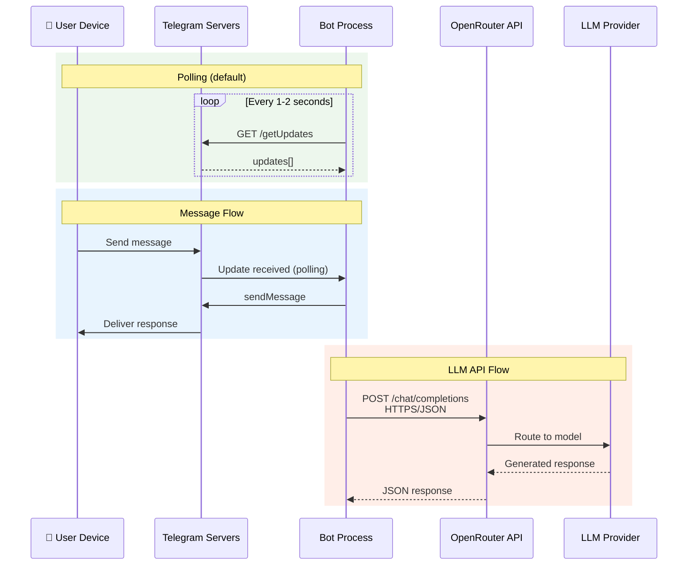
```mermaid
sequenceDiagram
    participant User as 👤 User Device
    participant TG as Telegram Servers
    participant Bot as Bot Process
    participant OR as OpenRouter API
    participant LLM as LLM Provider

    rect rgb(76, 175, 80, 0.1)
        Note over User,Bot: Polling (default)
        loop Every 1-2 seconds
            Bot->>TG: GET /getUpdates
            TG-->>Bot: updates[]
        end
    end

    rect rgb(33, 150, 243, 0.1)
        Note over User,Bot: Message Flow
        User->>TG: Send message
        TG->>Bot: Update received (polling)
        Bot->>TG: sendMessage
        TG->>User: Deliver response
    end

    rect rgb(255, 87, 34, 0.1)
        Note over Bot,LLM: LLM API Flow
        Bot->>OR: POST /chat/completions<br/>HTTPS/JSON
        OR->>LLM: Route to model
        LLM-->>OR: Generated response
        OR-->>Bot: JSON response
    end
```

---

## 8. User Journey View

### 8.1 First Time User Journey

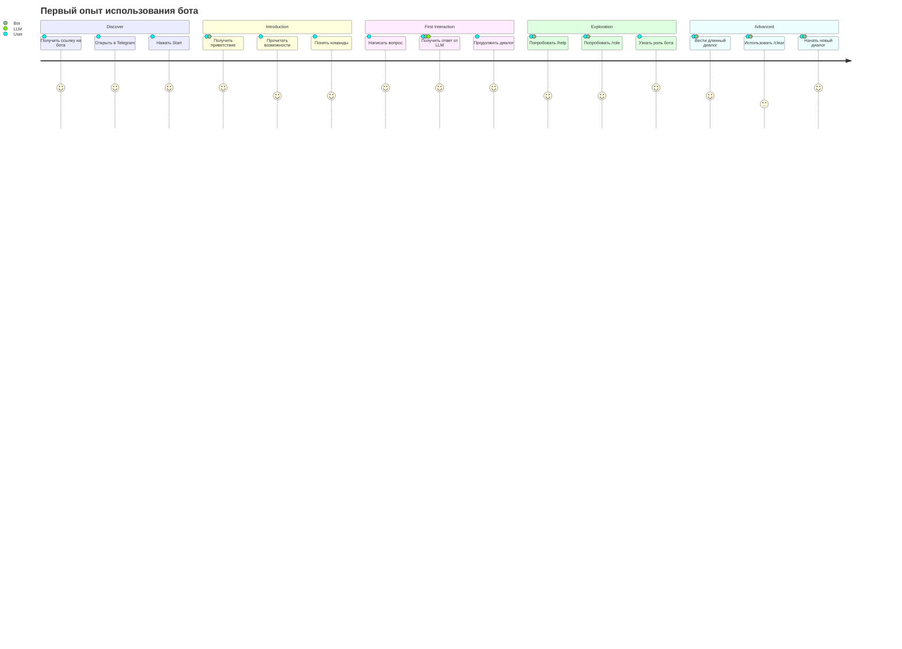
```mermaid
journey
    title Первый опыт использования бота
    section Discover
        Получить ссылку на бота: 5: User
        Открыть в Telegram: 5: User
        Нажать Start: 5: User
    section Introduction
        Получить приветствие: 5: User, Bot
        Прочитать возможности: 4: User
        Понять команды: 4: User
    section First Interaction
        Написать вопрос: 5: User
        Получить ответ от LLM: 5: User, Bot, LLM
        Продолжить диалог: 5: User
    section Exploration
        Попробовать /help: 4: User, Bot
        Попробовать /role: 4: User, Bot
        Узнать роль бота: 5: User
    section Advanced
        Вести длинный диалог: 4: User, Bot
        Использовать /clear: 3: User, Bot
        Начать новый диалог: 5: User, Bot
```

### 8.2 User Interaction Flowchart

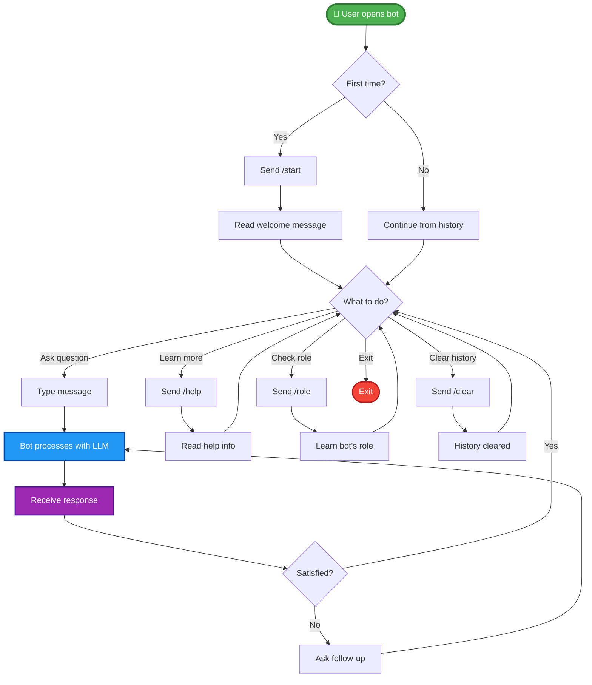
```mermaid
flowchart TD
    Start([👤 User opens bot]) --> FirstTime{First time?}

    FirstTime -->|Yes| Welcome[Send /start]
    FirstTime -->|No| Returning[Continue from history]

    Welcome --> ReadWelcome[Read welcome message]
    ReadWelcome --> Decision

    Returning --> Decision{What to do?}

    Decision -->|Ask question| Question[Type message]
    Decision -->|Learn more| Help[Send /help]
    Decision -->|Check role| Role[Send /role]
    Decision -->|Clear history| Clear[Send /clear]
    Decision -->|Exit| End([Exit])

    Question --> BotProcessing[Bot processes with LLM]
    BotProcessing --> Response[Receive response]
    Response --> Satisfied{Satisfied?}

    Satisfied -->|Yes| Decision
    Satisfied -->|No| Clarify[Ask follow-up]
    Clarify --> BotProcessing

    Help --> ReadHelp[Read help info]
    ReadHelp --> Decision

    Role --> ReadRole[Learn bot's role]
    ReadRole --> Decision

    Clear --> HistoryCleared[History cleared]
    HistoryCleared --> Decision

    style Start fill:#4CAF50,stroke:#2E7D32,stroke-width:3px,color:#fff
    style BotProcessing fill:#2196F3,stroke:#0D47A1,stroke-width:2px,color:#fff
    style Response fill:#9C27B0,stroke:#4A148C,stroke-width:2px,color:#fff
    style End fill:#F44336,stroke:#B71C1C,stroke-width:2px,color:#fff
```

### 8.3 Multi-User Scenario

```mermaid
gantt
    title Одновременная работа нескольких пользователей
    dateFormat HH:mm:ss
    axisFormat %H:%M:%S

    section User A
    Отправил сообщение 1    :active, ua1, 00:00:00, 1s
    Ожидание LLM           :ua1w, after ua1, 3s
    Получил ответ          :crit, ua1r, after ua1w, 1s
    Отправил сообщение 2    :ua2, after ua1r, 1s
    Ожидание LLM           :ua2w, after ua2, 2s
    Получил ответ          :crit, ua2r, after ua2w, 1s

    section User B
    Отправил сообщение 1    :active, ub1, 00:00:01, 1s
    Ожидание LLM           :ub1w, after ub1, 4s
    Получил ответ          :crit, ub1r, after ub1w, 1s

    section User C
    Отправил сообщение 1    :active, uc1, 00:00:03, 1s
    Ожидание LLM           :uc1w, after uc1, 3s
    Получил ответ          :crit, uc1r, after uc1w, 1s
```

---

## 9. Error Handling View

### 9.1 Error Flow Hierarchy

```mermaid
graph TD
    Error[❌ Error Occurs] --> Type{Error Type}

    Type -->|Config Error| ConfigErr[ValueError<br/>Missing tokens]
    Type -->|API Error| APIErr[Exception<br/>OpenRouter/Telegram]
    Type -->|Validation Error| ValErr[Invalid input<br/>Empty/Too long]
    Type -->|System Error| SysErr[Unexpected exception]

    ConfigErr --> Fatal[Log ERROR<br/>exit(1)]

    APIErr --> APIHandle[LLMClient logs]
    APIHandle --> Raise1[Raise to CM]
    Raise1 --> Raise2[Raise to TB]
    Raise2 --> UserError[Send error to user<br/>Continue running]

    ValErr --> Validate[TelegramBot validates]
    Validate --> UserMsg[Send validation error<br/>or ignore]

    SysErr --> MainCatch[main() catches]
    MainCatch --> Cleanup[Graceful shutdown]
    Cleanup --> Fatal

    UserError --> Continue[Bot continues]
    UserMsg --> Continue

    style Error fill:#F44336,stroke:#B71C1C,stroke-width:3px,color:#fff
    style Fatal fill:#000000,stroke:#000000,stroke-width:3px,color:#fff
    style Continue fill:#4CAF50,stroke:#2E7D32,stroke-width:2px,color:#fff
```

### 9.2 Error Propagation Chain

```mermaid
sequenceDiagram
    autonumber
    participant User as 👤 User
    participant TB as TelegramBot
    participant CM as ConversationManager
    participant LC as LLMClient
    participant API as OpenRouter

    User->>TB: Send message
    TB->>CM: process_message()
    CM->>LC: get_response()
    LC->>API: POST request

    rect rgb(244, 67, 54, 0.2)
        Note over API: ❌ API Error:<br/>Rate limit exceeded
        API-->>LC: 429 Too Many Requests

        Note over LC: Catch exception
        LC->>LC: logger.error("API Error: ...")
        LC-->>CM: raise Exception

        Note over CM: Propagate error
        CM-->>TB: raise Exception

        Note over TB: Handle gracefully
        TB->>TB: logger.error("Error processing...")
        TB->>TB: Send user-friendly message
        TB->>User: "❌ Извините, произошла ошибка..."
    end

    Note over TB,LC: Bot continues running
```

### 9.3 Error Recovery Strategy

```mermaid
stateDiagram-v2
    [*] --> Normal: Bot running

    Normal --> Error_Validation: Validation error
    Normal --> Error_API: API error
    Normal --> Error_System: System error

    Error_Validation --> Ignore: Empty message
    Error_Validation --> SendError: Too long

    Ignore --> Normal
    SendError --> Normal

    Error_API --> LogError: Log details
    LogError --> NotifyUser: Send friendly error
    NotifyUser --> Normal: Continue

    Error_System --> CriticalCheck{Critical?}
    CriticalCheck -->|No| Normal: Continue
    CriticalCheck -->|Yes| Shutdown: Graceful stop
    Shutdown --> [*]

    note right of Error_Validation
        User Input Issues
        Recoverable
    end note

    note right of Error_API
        External Service Issues
        Temporary, retry possible
    end note

    note right of Error_System
        Internal Issues
        May need restart
    end note
```

---

## 10. Development Workflow View

### 10.1 TDD Cycle (Red-Green-Refactor)

```mermaid
graph LR
    subgraph Red["🔴 RED"]
        WriteTest[Написать<br/>failing тест]
        RunTest[Запустить<br/>pytest]
        TestFails[❌ Test FAILS]
    end

    subgraph Green["🟢 GREEN"]
        WriteCode[Написать<br/>минимум кода]
        RunAgain[Запустить<br/>pytest]
        TestPasses[✅ Test PASSES]
    end

    subgraph Refactor["🔵 REFACTOR"]
        ImproveCode[Улучшить код<br/>SOLID, DRY]
        RunTests[Все тесты<br/>make test]
        AllPass[✅ All PASS]
    end

    Start([Новая фича]) --> WriteTest
    WriteTest --> RunTest
    RunTest --> TestFails

    TestFails --> WriteCode
    WriteCode --> RunAgain
    RunAgain --> TestPasses

    TestPasses --> ImproveCode
    ImproveCode --> RunTests
    RunTests --> AllPass

    AllPass --> Quality{make quality<br/>passed?}
    Quality -->|No| Fix[Исправить]
    Fix --> ImproveCode
    Quality -->|Yes| Done([Коммит])

    style WriteTest fill:#F44336,stroke:#B71C1C,stroke-width:2px,color:#fff
    style TestFails fill:#F44336,stroke:#B71C1C,stroke-width:2px,color:#fff
    style WriteCode fill:#4CAF50,stroke:#2E7D32,stroke-width:2px,color:#fff
    style TestPasses fill:#4CAF50,stroke:#2E7D32,stroke-width:2px,color:#fff
    style ImproveCode fill:#2196F3,stroke:#0D47A1,stroke-width:2px,color:#fff
    style AllPass fill:#4CAF50,stroke:#2E7D32,stroke-width:2px,color:#fff
    style Done fill:#4CAF50,stroke:#2E7D32,stroke-width:3px,color:#fff
```

### 10.2 Feature Development Timeline

```mermaid
gantt
    title Разработка новой фичи (TDD подход)
    dateFormat YYYY-MM-DD
    section Planning
    Определить фичу           :done, plan1, 2025-01-10, 1h
    Написать спеку            :done, plan2, after plan1, 30m
    section RED Phase
    Написать тесты            :active, red1, after plan2, 1h
    Запустить (fails)         :crit, red2, after red1, 5m
    section GREEN Phase
    Минимальная реализация    :green1, after red2, 2h
    Тесты проходят            :milestone, green2, after green1, 5m
    section REFACTOR Phase
    Применить SOLID           :blue1, after green2, 1h
    Добавить type hints       :blue2, after blue1, 30m
    Запустить make quality    :blue3, after blue2, 5m
    section Finalize
    Code review               :review, after blue3, 1h
    Merge PR                  :milestone, done, after review, 5m
```

### 10.3 Git Workflow

```mermaid
gitGraph
    commit id: "Initial commit"
    commit id: "MVP baseline"

    branch feature/new-command
    checkout feature/new-command
    commit id: "🔴 Add failing tests"
    commit id: "🟢 Minimal implementation"
    commit id: "🔵 Refactor with SOLID"
    commit id: "✅ All tests pass"

    checkout main
    branch feature/improve-error-handling
    commit id: "🔴 Tests for error cases"
    commit id: "🟢 Error handling code"

    checkout feature/new-command
    commit id: "📝 Update docs"

    checkout main
    merge feature/new-command tag: "v1.1.0"

    checkout feature/improve-error-handling
    commit id: "🔵 Refactor error messages"

    checkout main
    merge feature/improve-error-handling tag: "v1.2.0"

    commit id: "🚀 Production ready"
```

---

## 11. Testing Strategy View

### 11.1 Test Pyramid

```mermaid
graph TD
    subgraph Pyramid["🔺 Test Pyramid"]
        Manual[Manual Testing<br/>5%<br/>Exploratory, UX]
        E2E[Integration Tests<br/>15%<br/>Full flow testing]
        Unit[Unit Tests<br/>80%<br/>61 tests, 96% coverage]
    end

    Manual --> E2E
    E2E --> Unit

    subgraph Tools["🛠️ Tools"]
        Pytest[pytest<br/>Test runner]
        AsyncMock[AsyncMock<br/>Async testing]
        Coverage[pytest-cov<br/>Coverage reporting]
        Fixtures[conftest.py<br/>Shared fixtures]
    end

    Unit -.->|uses| Pytest
    E2E -.->|uses| AsyncMock
    Unit -.->|reports| Coverage
    Unit -.->|uses| Fixtures

    style Manual fill:#F44336,stroke:#B71C1C,stroke-width:2px,color:#fff
    style E2E fill:#FF9800,stroke:#E65100,stroke-width:2px,color:#fff
    style Unit fill:#4CAF50,stroke:#2E7D32,stroke-width:3px,color:#fff
```

### 11.2 Test Coverage Map

```mermaid
graph LR
    subgraph Source["📂 src/ (900 lines)"]
        Config[config.py<br/>110 lines<br/>100% ✅]
        Models[models.py<br/>30 lines<br/>100% ✅]
        MF[message_formatter.py<br/>40 lines<br/>100% ✅]
        CM[conversation_manager.py<br/>92 lines<br/>100% ✅]
        PL[prompt_loader.py<br/>140 lines<br/>100% ✅]
        Main[main.py<br/>72 lines<br/>97% ✅]
        LLM[llm_client.py<br/>85 lines<br/>96% ✅]
        HS[history_storage.py<br/>80 lines<br/>95% ✅]
        TB[telegram_bot.py<br/>240 lines<br/>95% ✅]
    end

    subgraph Tests["🧪 tests/ (61 tests)"]
        T_Config[test_config.py<br/>11 tests]
        T_Models[test_models.py<br/>3 tests]
        T_MF[test_message_formatter.py<br/>3 tests]
        T_CM[test_conversation_manager.py<br/>5 tests]
        T_PL[test_prompt_loader.py<br/>9 tests]
        T_Main[test_main.py<br/>6 tests]
        T_LLM[test_llm_client.py<br/>6 tests]
        T_HS[test_history_storage.py<br/>6 tests]
        T_TB[test_telegram_bot.py<br/>15 tests]
    end

    T_Config -->|covers| Config
    T_Models -->|covers| Models
    T_MF -->|covers| MF
    T_CM -->|covers| CM
    T_PL -->|covers| PL
    T_Main -->|covers| Main
    T_LLM -->|covers| LLM
    T_HS -->|covers| HS
    T_TB -->|covers| TB

    style Config fill:#4CAF50,stroke:#2E7D32,stroke-width:2px,color:#fff
    style Models fill:#4CAF50,stroke:#2E7D32,stroke-width:2px,color:#fff
    style MF fill:#4CAF50,stroke:#2E7D32,stroke-width:2px,color:#fff
    style CM fill:#4CAF50,stroke:#2E7D32,stroke-width:2px,color:#fff
    style PL fill:#4CAF50,stroke:#2E7D32,stroke-width:2px,color:#fff
```

### 11.3 Test Execution Flow

```mermaid
sequenceDiagram
    autonumber
    participant Dev as 👨‍💻 Developer
    participant Local as Local Machine
    participant Pytest as pytest
    participant Ruff as ruff
    participant Mypy as mypy
    participant CI as GitHub Actions

    Dev->>Local: git commit
    Dev->>Local: make quality

    rect rgb(33, 150, 243, 0.1)
        Note over Local,Mypy: Local Checks
        Local->>Ruff: ruff format --check
        Ruff-->>Local: ✅ Format OK

        Local->>Ruff: ruff check
        Ruff-->>Local: ✅ 0 errors

        Local->>Mypy: mypy src/
        Mypy-->>Local: ✅ Type check OK

        Local->>Pytest: pytest --cov=src
        Pytest-->>Local: ✅ 61/61 passed<br/>96% coverage
    end

    Dev->>CI: git push

    rect rgb(76, 175, 80, 0.1)
        Note over CI: CI/CD Pipeline
        CI->>CI: Checkout code
        CI->>CI: Install uv + Python 3.11
        CI->>CI: uv sync --dev
        CI->>CI: make quality
        CI-->>Dev: ✅ All checks passed
    end
```

---

## 12. Configuration View

### 12.1 Configuration Loading Priority

```mermaid
graph TD
    Start[Application Start] --> LoadDotenv[load_dotenv]

    LoadDotenv --> SysPrompt{System Prompt<br/>Configuration}

    SysPrompt -->|1. Highest Priority| CheckFile{SYSTEM_PROMPT_FILE<br/>in .env?}
    CheckFile -->|Yes| FileExists{File<br/>exists?}
    FileExists -->|Yes| LoadFile[📄 Load from file<br/>Priority 1]
    FileExists -->|No| FallbackText

    CheckFile -->|No| FallbackText{SYSTEM_PROMPT<br/>in .env?}
    FallbackText -->|Yes| LoadText[📝 Use from env<br/>Priority 2]
    FallbackText -->|No| UseDefault[🔧 Use default<br/>Priority 3<br/>'You are helpful...']

    LoadFile --> Done[System prompt loaded]
    LoadText --> Done
    UseDefault --> Done

    Done --> Other[Other config params]
    Other --> ValidateTokens{Required tokens<br/>present?}

    ValidateTokens -->|No| Error[❌ ValueError<br/>exit1]
    ValidateTokens -->|Yes| Ready[✅ Config ready]

    style Start fill:#4CAF50,stroke:#2E7D32,stroke-width:3px,color:#fff
    style LoadFile fill:#2196F3,stroke:#0D47A1,stroke-width:2px,color:#fff
    style LoadText fill:#FF9800,stroke:#E65100,stroke-width:2px,color:#fff
    style UseDefault fill:#9E9E9E,stroke:#424242,stroke-width:2px,color:#fff
    style Error fill:#F44336,stroke:#B71C1C,stroke-width:3px,color:#fff
    style Ready fill:#4CAF50,stroke:#2E7D32,stroke-width:3px,color:#fff
```

### 12.2 Environment Variables Structure

```mermaid
graph TB
    subgraph ENV[".env File"]
        subgraph Required["🔴 Required"]
            TG_TOKEN[TELEGRAM_BOT_TOKEN]
            OR_KEY[OPENROUTER_API_KEY]
        end

        subgraph Optional["🟡 Optional (with defaults)"]
            Model[DEFAULT_MODEL<br/>default: openai/gpt-3.5-turbo]
            Tokens[MAX_TOKENS<br/>default: 1000]
            Temp[TEMPERATURE<br/>default: 0.7]
            History[MAX_HISTORY_MESSAGES<br/>default: 10]
            Log[LOG_LEVEL<br/>default: INFO]
        end

        subgraph SystemPrompt["🟢 System Prompt (priority)"]
            PromptFile[SYSTEM_PROMPT_FILE<br/>Priority 1]
            PromptText[SYSTEM_PROMPT<br/>Priority 2]
            PromptDefault[Hardcoded default<br/>Priority 3]
        end
    end

    subgraph Config["Config Object"]
        ConfigObj[Config<br/>Validates and stores<br/>all parameters]
    end

    Required --> ConfigObj
    Optional --> ConfigObj
    SystemPrompt --> ConfigObj

    style Required fill:#F44336,stroke:#B71C1C,stroke-width:3px,color:#fff
    style Optional fill:#FF9800,stroke:#E65100,stroke-width:2px,color:#fff
    style SystemPrompt fill:#4CAF50,stroke:#2E7D32,stroke-width:2px,color:#fff
    style ConfigObj fill:#2196F3,stroke:#0D47A1,stroke-width:3px,color:#fff
```

### 12.3 Configuration Validation Flow

```mermaid
sequenceDiagram
    autonumber
    participant Main as main()
    participant Env as .env file
    participant Cfg as Config
    participant Validator as Validators

    Main->>Cfg: Config()
    Cfg->>Env: load_dotenv()

    rect rgb(244, 67, 54, 0.1)
        Note over Cfg,Validator: Validate Required
        Cfg->>Validator: _get_required_env("TELEGRAM_BOT_TOKEN")
        Validator->>Env: os.getenv("TELEGRAM_BOT_TOKEN")

        alt Token exists
            Env-->>Validator: "1234567890:ABC..."
            Validator-->>Cfg: token
        else Token missing
            Env-->>Validator: None
            Validator-->>Cfg: ❌ ValueError
            Cfg->>Main: raise ValueError
            Main->>Main: exit(1)
        end
    end

    rect rgb(76, 175, 80, 0.1)
        Note over Cfg,Validator: Validate Optional
        Cfg->>Validator: _get_optional_env("MAX_TOKENS", 1000)
        Validator->>Env: os.getenv("MAX_TOKENS")

        alt Value exists
            Env-->>Validator: "1500"
            Validator->>Validator: int("1500")
            Validator-->>Cfg: 1500
        else Value missing
            Env-->>Validator: None
            Validator-->>Cfg: 1000 (default)
        end
    end

    Cfg-->>Main: ✅ config object
```

---

## 📊 Summary Statistics

### Диаграммы в этом документе

| Категория | Количество | Типы диаграмм |
|-----------|-----------|---------------|
| **Architecture** | 3 | graph, C4Context |
| **Components** | 2 | graph |
| **Data Flow** | 3 | flowchart, graph |
| **Sequences** | 4 | sequenceDiagram, gantt |
| **State Machines** | 3 | stateDiagram-v2 |
| **Class Diagrams** | 2 | classDiagram |
| **Deployment** | 3 | graph, sequenceDiagram |
| **User Journey** | 3 | journey, flowchart, gantt |
| **Error Handling** | 3 | graph, sequenceDiagram, stateDiagram |
| **Development** | 3 | graph, gantt, gitGraph |
| **Testing** | 3 | graph, sequenceDiagram |
| **Configuration** | 3 | graph, sequenceDiagram |
| **ВСЕГО** | **35 диаграмм** | 10 разных типов |

### Точки зрения на проект

✅ **System View** - системная архитектура и контекст
✅ **Component View** - структура и зависимости компонентов
✅ **Data View** - потоки и трансформации данных
✅ **Process View** - временные последовательности
✅ **State View** - жизненные циклы и состояния
✅ **Structure View** - организация классов
✅ **Deployment View** - развертывание и runtime
✅ **User View** - пользовательские сценарии
✅ **Error View** - обработка ошибок
✅ **Development View** - процессы разработки
✅ **Quality View** - тестирование и проверки
✅ **Configuration View** - управление настройками

---

## 🎨 Color Palette Reference

Используемые цвета в диаграммах:

| Цвет | Hex | Назначение |
|------|-----|------------|
| 🟢 Green | `#4CAF50` / `#2E7D32` | Success, User, Start, Done |
| 🔵 Blue | `#2196F3` / `#0D47A1` | TelegramBot, Processes |
| 🟣 Purple | `#9C27B0` / `#4A148C` | ConversationManager, Orchestrators |
| 🔷 Cyan | `#00BCD4` / `#006064` | LLMClient, APIs |
| 🟠 Orange | `#FF9800` / `#E65100` | Config, Actions, Commands |
| 🔴 Red | `#F44336` / `#B71C1C` | Errors, Critical, Warnings |
| 🟤 Brown | `#795548` / `#3E2723` | Data Models, Storage |
| ⚫ Gray | `#9E9E9E` / `#424242` | Defaults, Secondary |
| 🟧 Deep Orange | `#FF6B35` / `#D84315` | External APIs, OpenRouter |

---

**🎨 Visual Guide завершен!**
**35 диаграмм с 12 различных точек зрения на проект**

Для навигации используй [Содержание](#-содержание) в начале документа.
